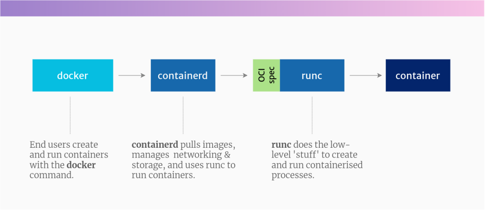
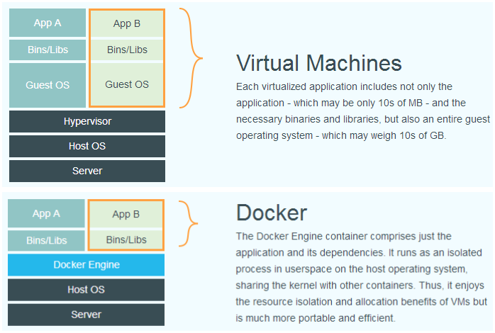
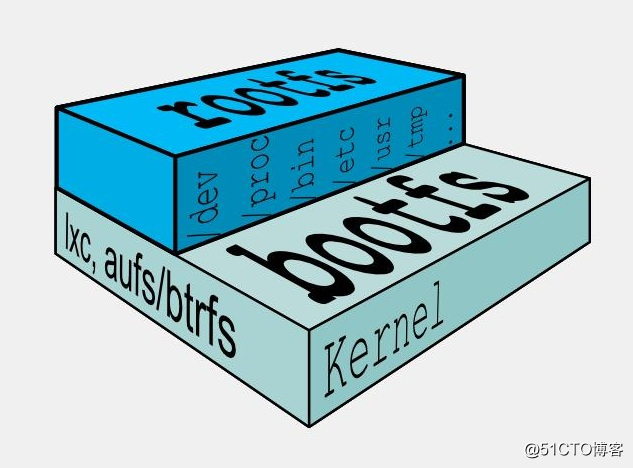
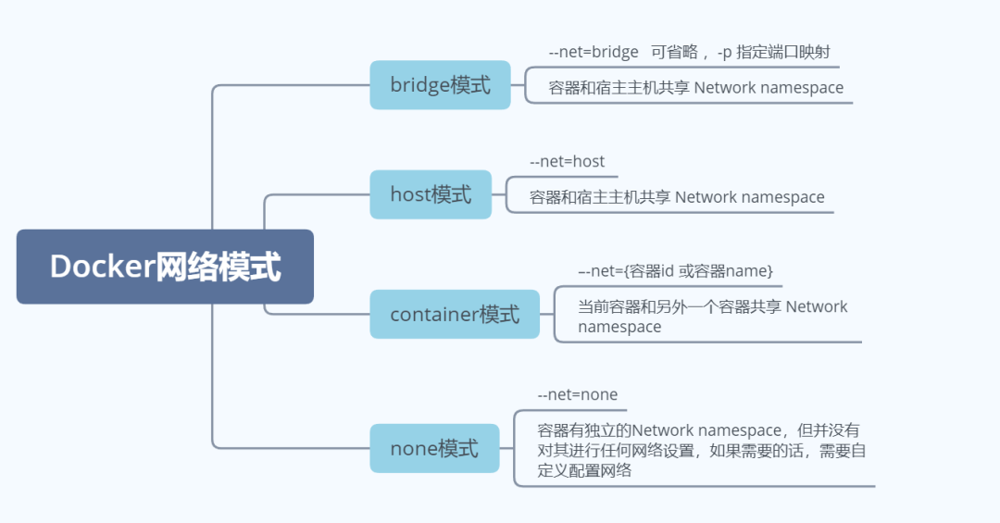
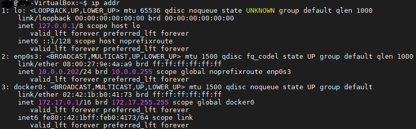
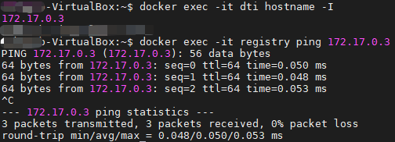
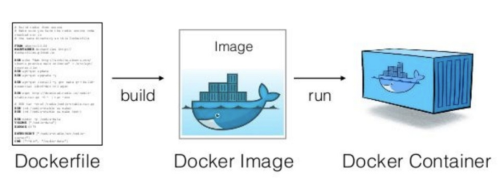
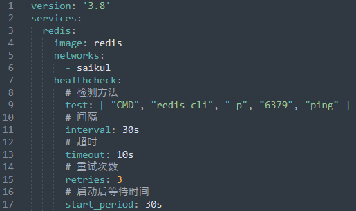

# Docker


Docker 是基于 Go 语言实现的开源容器项目

为什么要使用 Docker？

1. 一致的运行环境
2. 更便捷的部署和运维
3. 更高效的资源利用

Docker 与 虚拟化：Docker 等容器技术属于操作系统虚拟化的范畴。相比传统方式在硬件层面的虚拟化，需要有额外的虚拟机管理应用和虚拟机操作系统，Docker 容器在操作系统层面实现虚拟化，并直接复用本地主机的操作系统，因此更加轻量级。

## Docker 安装

### Centos 7 环境下安装

1. 为了方便添加软件源以及支持 devicemapper 存储支持

   `sudo yum install -y yum-utils device-mapper-persistent-data lvm2`

2. 添加 Docker 稳定版本的 yum 软件源

   `sudo yum-config-manager --add-repo http://mirrors.aliyun.com/docker-ce/linux/centos/docker-ce.repo`

3. 更新 yum 软件源缓存并安装 Docker

   `sudo yum update`

   `sudo yum install -y docker-ce`

4. 确认 Docker 服务启动成功

   `sudo systemctl start docker`

### Ubuntu 环境下安装

1. 安装使用 HTTPS 传输的软件包以及 CA 证书

   `sudo apt-get install apt-transport-https ca-certificates curl gnupg lsb-release`

2. 添加 docker 官方的 GPG 密钥

   `curl -fsSL http://mirrors.aliyun.com/docker-ce/linux/ubuntu/gpg | sudo apt-key add -`

3. 添加 docker 的软件源

   `sudo add-apt-repository "deb [arch=amd64] http://mirrors.aliyun.com/docker-ce/linux/ubuntu $(lsb_release -cs) stable"`

4. 安装 docker

   `sudo apt-get install docker-ce`

5. 配置用户组（默认情况下，只有 root 和 docker 组的用户才可以运行 docker 命令）

   `sudo usermod -aG docker $USER`

6. 启动 docker

   `systemctl start docker`

## Docker 三大概念


<center>镜像、容器、仓库三者关系图</center>

### 镜像 image

Docker 镜像是一个特殊的文件系统，除了提供容器运行时所需的程序、库、资源、配置等文件外，还包含了一些为运行时准备的一些配置参数（如匿名卷、环境变量、用户等）。镜像不包含任何动态数据，其内容在构建之后也不会被改变。

常用命令

- 搜寻镜像：`docker search`
- 拉取镜像：`docker pull`
- 列出所有镜像：`docker images`
- 查看镜像信息：`docker inspect`
- 查看镜像创建过程：`docker history `（过长命令被截断可以使用 --no-trunc 选项输出完整命令）
- 删除镜像：`docker rmi`

- 创建镜像

  **基于现有容器创建**：`docker commit`

  > 当容器与镜像对比发生变化时，可以使用该命令提交一个新的镜像

  语法：`docker commit [OPTIONS] CONTAINER [REPOSITORY[:TAG]]`

  | 参数         | 用途                             |
  | ------------ | -------------------------------- |
  | -a，--author | 著名作者                         |
  | -c，--change | 在导入过程中使用 dockerfile 指令 |
  | -m，massage  | 提交的说明信息                   |
  | -p，--pause  | 提交镜像前暂停容器               |

  PS：该方式适用于例如 *被入侵后保护现场* 等特殊场景

  **基于本地模板导入**：`docker import`

  > 从一个 tar 或者 url 导入容器快照

  语法：`docker import [OPTIONS] file|URL|- [REPOSITORY[:TAG]]`

  | 参数          | 用途                             |
  | ------------- | -------------------------------- |
  | -c，--change  | 在导入过程中使用 dockerfile 指令 |
  | -m，--message | 导入的说明信息                   |

  **基于 Dockerfile 生成**：`docker build`

  > 从 dockerfile 构建 docker 镜像

  语法：`docker buildx build [OPTIONS] PATH | URL | -`

  | 参数       | 用途                 |
  | ---------- | -------------------- |
  | -f，--file | 指定 dockerfile 路径 |
  | -t，--tag  | 指定镜像名称和版本   |

- 保存和加载镜像
  - 保存一个或多个镜像：`docker save -o {FILE} IMAGE [IMAGE...]`
  - 从文件载入镜像：`docker load -i {FILE}`
- 上传镜像：`docker push [REPOSITORY/]IMAGE[:TAG]`

### 容器 container

容器是镜像的一个运行实例

常用命令：

- 创建容器：`docker create`

  | 参数          | 用途         |
  | ------------- | ------------ |
  | --name        | 指定容器名称 |
  | -e，--env     | 设置环境变量 |
  | -v，--volume  | 挂载数据卷   |
  | -p，--publish | 暴露端口     |

- 启动容器：`docker run`

- 创建并运行容器：`docker run` 等同于执行 `docker create` 后再执行 `docker start`

- 查看所有容器：`docker ps`

- 查看容器输出：`docker logs`

- 停止容器：`docker stop`

- 进入容器：`docker exec -it image /bin/bash`

- 删除容器：`docker rm`

- 容器导出：`docker export`

- 容器导入：`docker import`

- 查看容器详情：`docker container inspect`

- 查看容器内进程：`docker top`

- 查看容器统计信息：`docker stats`

- 宿主机和容器间复制文件：`docker cp`

- 查看容器变更内容：`docker diff`

- 查看端口映射：`docker port`

- 修改容器运行时配置：`docker update`

### 仓库 repository

仓库（Repository）是集中存放镜像的地方。

一个容易混淆的概念是注册服务器（Registry）。实际上注册服务器是管理仓库的具体服务器，每个服务器上可以有多个仓库，而每个仓库下面有多个镜像。从这方面来说，仓库可以被认为是一个具体的项目或目录。例如对于仓库地址 docker.io/ubuntu 来说，docker.io 是注册服务器地址，ubuntu 是仓库名。

**如何配置镜像源？**

linux

在 `/etc/docker/daemon.json` 内维护注册服务器地址属性 `registry-mirrors`

本案例选用 DaoCloud 组织提供的国内免费镜像源

```json
{
  "registry-mirrors": [
    "https://docker.m.daocloud.io"
  ]
}
```

windows

在 Docker Desktop 设置 Docker Engine 内修改，配置同上

**私有仓库 Registry**

私有库 registry 相当于本地有一个 Docker Hub

安装方式：

1. 拉取 registry：`docker pull registry:2`
2. 启动仓库：`docker run -d -p 5000:5000 --name registry registry:2`

查看私有库上面的镜像：`curl -XGET http://{ip}:{port}/v2/_catalog`

上传镜像到指定仓库：`docker push {ip}:{port}/image[:tag]`

拉取指定仓库镜像：`docker pull {ip}:{port}/image[:tag]`

:star: 配置私有仓库

在 daemon.json 文件内添加非 http 不安全仓库

```json
{
  "insecure-registries": [
    "ip:port"
  ]
}
```

重启 docker：`systemctl restart docker`

拉取私有仓库镜像：`docker pull ip:port/image[:tag]`

**HTTP API**

- 查看镜像 tags：`curl {ip}:{port}/v2/image/tags/list`
- 查询镜像 digest_hash：`curl --header "Accept: application/vnd.docker.distribution.manifest.v2+json" -I -X GET {ip}:{port}/v2/image/manifests/{tag}`
- 删除镜像 tag：`curl -I -X DELETE {ip}:{port}/v2/openresty/manifests/{digest_hash}`

**认证配置**

## Docker 架构



- Containerd

  Containerd 是 docker 基于行业标准创建的核心容器运行时。它可以用作 Linux 和 Windows 的守护进程，并管理整个容器生命周期：镜像的传输和存储、容器的执行和管理、存储和网络等。

- runC：轻量级的容器运行时

  我们可以认为它就是个命令行小工具，可以不用通过 docker 引擎，直接运行容器。事实上，runC 是标准化的产物，它根据 OCI 标准来创建和运行容器。而 OCI(Open Container Initiative)组织，旨在围绕容器格式和运行时制定一个开放的工业化标准。



### UnionFS（联合文件系统）

Union 文件系统是一种分层、轻量级并且高性能的文件系统，它支持对文件系统的修改作为一次提交来一层层的叠加，同时可以将不同目录挂载到同一个虚拟文件系统下。容器镜像设计中，为了解决各类依赖以及依赖共享，正是利用 UnionFs 实现了镜像分层，再结合 bootfs、rootfs，一层层继承、叠加。启动容器时把相关的层挂载到一个目录，作为容器的根文件系统，这就是容器镜像的原理。

- bootfs（boot file system）：主要包含 bootloader 和 kernel，在内核启动后，bootfs 会被卸载。
- rootfs（root file system）：包含系统常见的目录结构，如 /dev，/proc， /bin，/etc 等标准目录和文件。rootfs 就是各种不同的操作系统发行版，比如 Ubuntu，Centos 等等。



### 分层存储（Layered Storage）

Docker Hub 中 99% 的镜像都是通过在 base 镜像中安装和配置需要的软件构建出来的。每个 Docker 镜像由多个层叠加而成，每一层代表一个文件系统的快照，这些层共同构成了一个完整的镜像文件系统。

分层存储的用途：

- 镜像复用：当多个镜像共享相同的基础层时，它们只需要在本地存储中保存一份基础层的副本，避免了重复存储相同内容的问题。
- 镜像的传输效率：镜像的分层存储结构允许只传输更改的层，而不是整个镜像，因此在传输时只需要传输更新的部分，减少了传输的数据量，提高了传输效率。
- 镜像的版本管理：每个镜像层都是只读的，当需要更新或修改镜像时，只需新增一层来覆盖原有的层，这样就可以实现版本管理，方便用户管理和回滚镜像的不同版本。

**可写的容器层**

当容器启动时，一个新的可写层被加载到镜像的顶部。这一层通常被称作“容器层”，“容器层”之下的都叫“镜像层”。所有对容器的改动，无论添加、删除、还是修改文件都只会发生在容器层中。只有容器层是可写的，容器层下面的所有镜像层都是只读的。

1. 添加文件：在容器中创建文件时，新文件被添加到容器层中。
2. 读取文件：在容器中读取某个文件时，Docker 会从上往下依次在各镜像层中查找此文件。一旦找到，立即将其复制到容器层，然后打开并读入内存。
3. 修改文件：在容器中修改已存在的文件时，Docker 会从上往下依次在各镜像层中查找此文件。一旦找到，立即将其复制到容器层，然后修改之。
4. 删除文件：在容器中删除文件时，Docker 也是从上往下依次在镜像层中查找此文件。找到后，会在容器层中记录下此删除操作。


### Namespace 命名空间

namespace 是 Linux 内核用来隔离内核资源的方式。通过 namespace 可以让一些进程只能看到与自己相关的一部分资源，而另外一些进程也只能看到与它们自己相关的资源，这两拨进程根本就感觉不到对方的存在。具体的实现方式是把一个或多个进程的相关资源指定在同一个 namespace 中。

linux 内核的 namespace 特性为我们提供的隔离能力：


### CGroups 控制组

控制组（cgroups）是 Linux 内核的一个特性，主要用来对共享资源进行隔离、限制、审计等。只有能控制分配到容器的资源，才能避免当多个容器同时运行时的对系统资源的竞争。

控制组提供如下功能：

- 资源限制：可以将组设置一定的内存限制。比如：设定内存使用上限后，一旦进程组使用的内存达到限额再申请内存就会触发 Out of Memary 警告
- 优先级：通过优先级设定让一些组可以得到更多的 CPU 资源
- 资源审计：用来统计系统实际上把多少资源用到合适的目的上，可以使用 cpuacct 子系统记录某个进程组使用的 CPU 时间
- 隔离：为组隔离命名空间，这样使得一个组不会看到另一个组的进程、网络连接和文件系统
- 控制：执行挂起、恢复和重启等操作

### 网络模式

Docker 的容器通过 Linux 的命名空间完成了与宿主机进程的网络隔离，但是 Docker 中的服务仍然需要与外界相连才能发挥作用。

Docker 为我们提供了四种不同的网络模式，Host、Container、None 和 Bridge 模式。



**bridge 模式（默认）**

我们只要安装了docker就会有一个 docker0 的网卡，使用的桥接模式。docker0 会为每一个容器分配一个新的 IP 地址并将 docker0 的 IP 地址设置为默认的网关。



当我们通过 `docker exec -it container1 hostname -I` 命令查看一个默认网络模式的容器，用另一个容器去 `ping` 是可以 `ping` 通的。bridge 模式下的**容器与容器之间是可以互相ping通的**。



**host 模式**

告诉 Docker 不要将容器网络放到隔离的命名空间中，即不要容器化容器内的网络。此时容器使用本地主机的网络，它拥有完全的本地主机接口访问权限。

**container 模式**

Docker 的 container 网络模式是指新创建的容器和已经存在的一个容器共享一个Network Namespace。这意味着新创建的容器不会创建自己的网卡、配置自己的IP地址，而是和一个已存在的容器共享IP地址、端口范围等网络资源。

命令：`docker run --net=container:name/id image`

**none 模式**

让 Docker 将新容器放到隔离的网络栈中，但是不进行网络配置。在这种模式下，容器内部没有网卡、IP地址、路由等信息。这意味着容器不能访问外部网络，也不能被外部网络访问。

Libnetwork 网络驱动 - todo

## Dockerfile



Dockerfile 是一个文本格式的配置文件，用户可以使用 Dockerfile 来快速创建自定义的镜像

<table>
    <tr>
    	<th align='center'>分类</th>
        <th align='center'>指令</th>
        <th align='center'>说明</th>
    </tr>
    <tr>
    	<td rowspan=13 align='center'>配置指令</td>
        <td>ARG</td>
        <td>定义创建镜像过程中使用的变量</td>
    </tr>
    <tr>
        <td>FROM</td>
        <td>指定所创建镜像的基础镜像</td>
    </tr>
    <tr>
        <td>LABEL</td>
        <td>为生成的镜像添加元数据标签信息</td>
    </tr>
    <tr>
        <td>EXPOSE</td>
        <td>声明镜像内服务监听的端口</td>
    </tr>
    <tr>
        <td>ENV</td>
        <td>指定环境变量</td>
    </tr>
    <tr>
        <td>ENTRYPOINT</td>
        <td>指定镜像的默认入口命令</td>
    </tr>
    <tr>
        <td>VOLUME</td>
        <td>创建一个数据卷挂载点</td>
    </tr>
    <tr>
        <td>USER</td>
        <td>指定运行容器时的用户名或UID</td>
    </tr>
    <tr>
        <td>WORKDIR</td>
        <td>配置工作目录</td>
    </tr>
    <tr>
        <td>ONBUILD</td>
        <td>创建子镜像时指定自动执行的操作指令</td>
    </tr>
    <tr>
        <td>STOPSIGNAL</td>
        <td>指定退出的信号值</td>
    </tr>
    <tr>
        <td>HEALTHCHECK</td>
        <td>配置所启动容器如何进行健康检查</td>
    </tr>
    <tr>
        <td>SHELL</td>
        <td>指定默认的sheel类型</td>
    </tr>
    <tr>
    	<td rowspan=4 align='center'>操作指令</td>
        <td>RUN</td>
        <td>运行指定命令</td>
    </tr>
    <tr>
        <td>CMD</td>
        <td>启动容器时指定默认执行的命令</td>
    </tr>
    <tr>
        <td>ADD</td>
        <td>添加内容到镜像</td>
    </tr>
    <tr>
        <td>COPY</td>
        <td>复制内容到镜像</td>
    </tr>
</table>

**将 Spring Boot 项目成镜像**

编写 Dockerfile 文件

```
# 指定基础镜像
FROM openjdk:11
# 复制jar包到容器中
ADD target/dockerfile-test-image.jar dockerfile-test-image.jar
# 声明服务端口
EXPOSE 8080
# 容器启动运行程序命令
ENTRYPOINT ["java", "-jar", "dockerfile-test-image.jar"]
```

## Docker Compose

Compose 项目是 Docker 官方的开源项目，负责实现对基于 Docker 容器的多应用服务的快速编排。通过 Compose 使我们可以通过 yaml 格式文件定义一组相关联的应用容器并通过单个命令完成应用的创建和启动。

Compose 的使用方式非常简单，基本上就是下面的三板斧：

- 定义 Dockerfile
- 定义 docker-compose.yml
- 运行 docker-compose up

**安装 Docker Compose**

直接下载可执行文件到本地

```shell
$ sudo curl -L https://github.com/docker/compose/releases/download/v2.30.3/docker-compose-$(uname -s)-$(uname -m) -o /usr/local/bin/docker-compose
$ sudo chmod +x /usr/local/bin/docker-compose
```

**Compose 模板文件**

| 命令           | 功能                                                         |
| -------------- | ------------------------------------------------------------ |
| container_name | 指定容器名称                                                 |
| image          | 指定镜像名称或ID                                             |
| ports          | 暴露端口                                                     |
| volumes        | 挂载数据卷                                                   |
| environment    | 设置环境变量                                                 |
| networks       | 加入网络                                                     |
| depends_on     | 指定多个服务之间的依赖关系，会先启动被依赖的服务             |
| healthcheck    | 健康检测机制<br /> |

<center>Compose 模板文件主要命令</center>

example

```yaml
version: '3.8'
services:
  mysql:
    container_name: gogs-mysql
    image: mysql:8.0.25
    environment:
      - MYSQL_ROOT_PASSWORD=123456
    ports:
      - "3308:3306"
```

## Docker Swarm

Docker Swarm 提供容器集群服务，是 Docker 官方对容器云生态进行支持的核心方案。作为容器集群管理器，Swarm 最大的优势之一就是原生支持 Docker API，各种基于标准 API 的工具都可以很容易的与 Swarm 集成。

**基本概念**

- Swarm 集群
- 节点
- 服务
- 任务

**创建 Swarm 集群**

1. 创建集群

   在管理节点上执行如下命令来创建一个新的 Swarm 集群，创建成功后会提示加入工作节点的命令，其中，返回的 token 串时集群的唯一 id，加入集群的每个节点都需要这个信息。如果在执行初始化集群命令后忘记，也可以执行 `docker swarm join-token worker` 命令再次查询。

   ```shell
   $ docker swarm init --advertise-addr {manager ip}
   Swarm initialized: current node (fbvs8l8lgp359vjodesipz3bv) is now a manager.
   
   To add a worker to this swarm, run the following command:
   
       docker swarm join --token SWMTKN-1-39awzfrf9c54ct8s76gq9eqs4yw6wjligb0swomt1zyqt48vmi-6xx9o482nmzg5t5lxql2ckhlt {manager ip}:2377
   
   To add a manager to this swarm, run 'docker swarm join-token manager' and follow the instructions.
   ```

   PS：默认的管理服务端口为 2377，工作节点加入集群需要访问该端口，防火墙需要放开访问权限

   ubuntu ufw 防火墙开放 2377 端口：`sudo ufw allow 2377`

   查询防火墙开放端口状态：`sudo ufw status`

   最后需要重启防火墙：`sudo ufw reload`

2. 查看集群

   通过 docker info 命令查看集群信息

   ```shell
   $ docker info
   ...
    Swarm: active
     NodeID: fbvs8l8lgp359vjodesipz3bv
     Is Manager: true
     ClusterID: mxnzix0847z677qp9wr7dmnhx
     Managers: 1
     Nodes: 2
     Default Address Pool: 10.0.0.0/8
     SubnetSize: 24
     Data Path Port: 4789
     Orchestration:
      Task History Retention Limit: 5
     Raft:
      Snapshot Interval: 10000
      Number of Old Snapshots to Retain: 0
      Heartbeat Tick: 1
      Election Tick: 10
     Dispatcher:
      Heartbeat Period: 5 seconds
     CA Configuration:
      Expiry Duration: 3 months
      Force Rotate: 0
     Autolock Managers: false
     Root Rotation In Progress: false
     Node Address: 10.0.0.202
     Manager Addresses:
      10.0.0.202:2377
   ...
   ```

   查询集群节点情况

   ```shell
   $ docker node ls
   ID                            HOSTNAME     STATUS    AVAILABILITY   MANAGER STATUS   ENGINE VERSION
   fbvs8l8lgp359vjodesipz3bv *   10.0.0.202   Ready     Active         Leader           27.3.1
   ```

3. 加入集群

   使用初始化 Swarm 时返回的 join 命令以 worker 节点加入集群

   ```shell
   # docker swarm join --token SWMTKN-1-39awzfrf9c54ct8s76gq9eqs4yw6wjligb0swomt1zyqt48vmi-6xx9o482nmzg5t5lxql2ckhlt 10.0.0.202:2377
   This node joined a swarm as a worker.
   ```

   如果需要以 manager 节点的形式加入集群，可以调用 `docker swarm join-token manager` 命令得到 join 命令

**集群服务命令**

| 命令    | 说明         | 命令     | 说明               |
| ------- | ------------ | -------- | ------------------ |
| create  | 创建应用     | rm       | 删除服务           |
| inspect | 查看详细信息 | rollback | 回滚服务           |
| logs    | 查看应用日志 | scale    | 对服务进行横向扩展 |
| ls      | 列出服务信息 | update   | 更新服务           |
| ps      | 列出任务信息 |          |                    |

## 参考资料

[1]:《Docker技术入门与实践第3版》
[2]:https://www.cnblogs.com/sparkdev/p/8998546.html	"Docker 生态概览"
[3]:https://zhuanlan.zhihu.com/p/490585683	"Docker，containerd，CRI，CRI-O，OCI，runc 分不清？看这一篇就够了"

[4]:https://www.thebyte.com.cn/container/unionfs.html	"UnionFs 联合文件系统"
[5]:https://www.cnblogs.com/handwrit2000/p/12871493.html	"docker 镜像分层原理"
[6]:https://www.cnblogs.com/xiongzaiqiren/p/18177383/docker-network	"docker网络配置"
[7]:https://zhuanlan.zhihu.com/p/102794942	"使用Dockerfile为SpringBoot应用构建Docker镜像"
