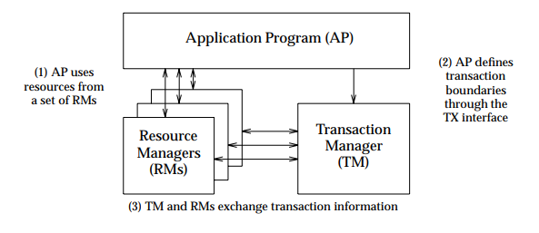
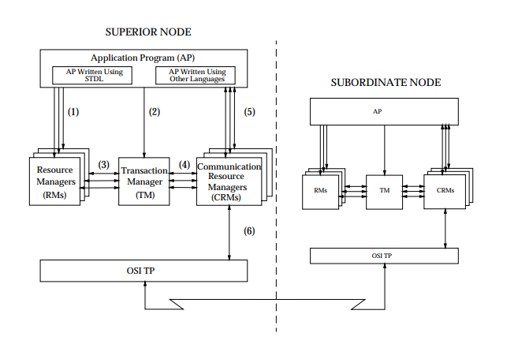
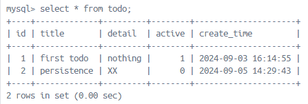
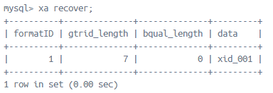
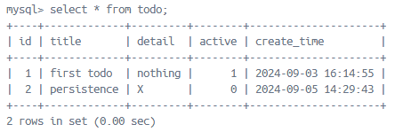
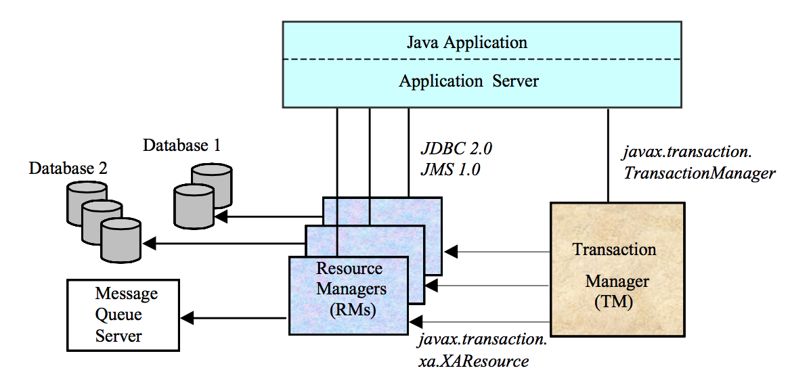
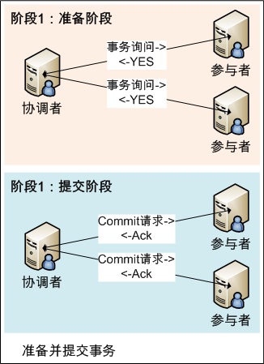
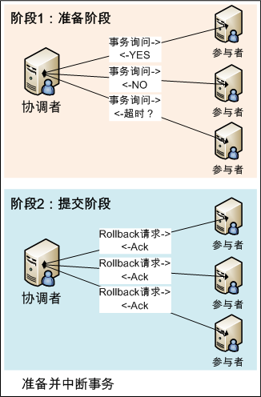
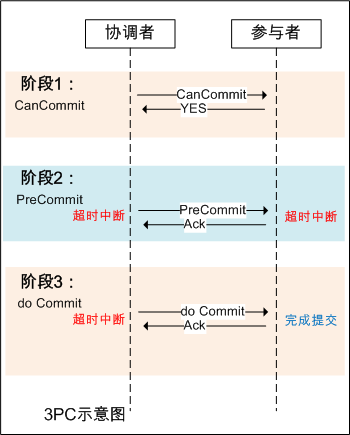

### 分布式事务（Distributed Transactions）

> 分布式系统会把一个应用系统拆分为可独立部署的多个服务，因此需要服务与服务之间远程协作才能完成事务操作，这种分布式系统环境下由不同的服务之间通过网络远程协作完成事务称之为分布式事务

#### DTP 模型

由 The Open Group 组织提出的分布式事务处理模型，其中定义的三个角色：

- AP（Application）：应用程序
- RM（Resource Manager）：资源管理器，通常指数据库
- TM（Transaction Manager）：事务协调者，负责协调和管理 DTP 模型中的事务
- CRM（Communication Resource Manager）：通讯资源管理者，控制一个或多个 TM domain 之间分布式应用的通信



<center>
    X/Open DTP Model
</center>

功能组件接口



<center>
    Functional Components and Interfaces
</center>

- AP-RM：使 AP 可以访问资源
- AP-TM：AP 使用 TM 协调全局事务管理
- TM-RM（XA）：TM 协调 RMs 提交和回滚
- TM-CRM（XA+）：支持全局事务信息跨 TM Domains 通讯
- AP-CRM：全局事务 APs 与 DTP 通信

参考资料：

[1]: http://pubs.opengroup.org/onlinepubs/9294999599/toc.pdf	"Distributed Transaction Processing: Reference Model - DTP 参考模型"

#### XA 规范

在 XA 规范中，应用程序使用 XA API 与事务管理器进行交互，而事务管理器使用 XA API 与各个资源管理器进行交互。XA 规范定义了一组标准的接口函数，包括开始全局事务、结束全局事务、提交全局事务、回滚全局事务等。通过这些接口函数，应用程序可以实现分布式事务的提交和回滚，从而保证事务的一致性和可靠性。

***ax_*** 是 RM 调用 TM 的方法前缀，所有 TMs 都需要提供程序让 RM 可以参与到事务

- ax_reg：注册 RM 到 TM
- ax_unreg：把 RM 从 TM 注销

***xa_*** 是 RMs 在 DTP 环境中被 TM 调用的方法前缀，例如：当 AP 调用 TM 开启一个全局事务时，TM 会调用 xa_open 来通知事务分支的 RMs

- xa_open：在 AP 中实例化 RM
- xa_close：终止 APs 对 RM 的使用
- xa_start：开始或恢复一个事务分支，并将 future 线程的 XID 关联到 RM
- xa_end：将线程与事务分支接触关联
- xa_prepare：询问 RM 是否已经准备好提交事务
- xa_commit：通知 RM 提交事务
- xa_rollback：通知 RM 回滚事务
- xa_recover：获取可以恢复的事务 XID 列表

XA 规范目前主流的数据库均提供了支持，下面以 MySQL 为例示范全局事务

1）查询 TODO 表数据



2）开启事务

> mysql> xa start "xid_001";

3）查询事务



4）执行更新语句

> mysql> update todo set detail = 'X' where id = 2;

5）断开事务

> mysql> xa end "xid_001";

6）查询 TODO 表数据

> mysql> select * from todo;
> ERROR 1399 (XAE07): XAER_RMFAIL: The command cannot be executed when global transaction is in the  IDLE state

当全局事务未提交前，操作被拒绝

7）提交准备工作完毕

> mysql> xa prepare "xid_001";

8）查询 TODO 表数据


数据未变化，因为事务还未提交，但是准备工作完毕释放了资源访问极大的缩短了锁住资源的时间

9）提交事务

> mysql> xa commit "xid_001";

8）查询 TODO 表数据



事务提交后，数据被更新

**PS **特别情况

1. 当存在一个全局事务时，无法开启第二个全局事务

   > mysql> xa start "xid_002";
   > ERROR 1399 (XAE07): XAER_RMFAIL: The command cannot be executed when global transaction is in the  IDLE state

2. 当存在一个未提交的全局事务，更新操作会被阻塞

**JTA**

XA 规范不是 Java 的规范，JTA（Java Transaction API）是 XA 规范的 Java 实现，具体接口有：

- 事务管理器 - javax.transaction.TransactionManager：定义了事务的操作方法
- 资源管理器 - javax.transaction.xa.XAResource：资源需要支持 JTA 事务，就需要实现该接口定义的两阶段提交方法



参考资料：

[1]:https://pubs.opengroup.org/onlinepubs/009680699/toc.pdf	"Distributed Transaction Processing: The XA Specification - XA 规范"
[2]:https://www.thebyte.com.cn/distributed-system/XA.html	"分布式事务标准规范：XA 规范"
[3]: https://blog.csdn.net/zzti_erlie/article/details/120244865	"MySQL XA 命令"

#### 二阶段提交/XA（2PC）

两阶段指：

1. Prepare 准备
2. Commit/Rollback 提交

|  |  |
| ---------------------------------------------------------- | ------------------------------------------------------------ |

二阶段协议的优缺点：

两阶段提交逻辑设计容易理解、逻辑清晰简单，但在实际场景中也存在不少问题，主要包括以下三点：

- 同步阻塞问题：两阶段提交协议的阻塞主要体现在参与者需要协调者的指令才能执行第二阶段的操作。当协调者发生故障时，参与者在第一阶段锁定的资源将一直无法释放。
- 潜在数据不一致风险：在第二阶段，如果因为网络异常导致一部分参与者收到 Commit 请求，而另一部分没有收到 Commit 请求，那么结果将是部分参与者提交了事务，而另一部分参与者无法提交。
- 单点问题和脑裂
  单点问题：二阶段提交过于依赖协调者，当协调者发生故障时，整个集群将不可用。
  脑裂：当集群出现多个协调者时，将无法保证二阶段提交协议的正确性。

在 Java 中使用 **Atomikos** 管理分布式事务

Atomikos 是一个开源的分布式事务管理器，支持 Java 平台。它可以与 JTA（Java Transaction API）和 JDBC（Java Database Connectivity）完美集成。Atomikos 提供了分布式事务的管理功能，包括两阶段提交（2PC）和 XA 事务。

简单 Java 示例

1）引入 Atomikos 依赖

```xml
<dependency>
    <groupId>com.atomikos</groupId>
    <artifactId>transactions-jms</artifactId>
    <version>4.0.6</version>
</dependency>
<dependency>
    <groupId>com.atomikos</groupId>
    <artifactId>transactions-jdbc</artifactId>
    <version>4.0.6</version>
</dependency>
```

2）实例化 UserTransaction

```java
UserTransaction ut = new UserTransactionImp();
```

3）实例化 DataSource

```java
public AtomikosDataSourceBean generateAtomikosDataSource(String resourceName, String user, String password, String url) {
    Properties properties = new Properties();
    properties.setProperty("user", user);
    properties.setProperty("password", password);
    properties.setProperty("url", url);
    AtomikosDataSourceBean dataSource = new AtomikosDataSourceBean();
    dataSource.setUniqueResourceName(resourceName);
    // 示例中使用 MySQL 数据库
    dataSource.setXaDataSourceClassName("com.mysql.cj.jdbc.MysqlXADataSource");
    dataSource.setXaProperties(properties);
    return dataSource;
}
```

4）执行双库数据更新

```java
@Test
public void success() throws SystemException, HeuristicRollbackException, HeuristicMixedException, RollbackException {
    UserTransaction ut = new UserTransactionImp();
    AtomikosDataSourceBean dataSource1 = this.generateAtomikosDataSource("dataSource1", "root", "123456", "jdbc:mysql://localhost:3306/db_01");
    AtomikosDataSourceBean dataSource2 = this.generateAtomikosDataSource("dataSource2", "root", "123456", "jdbc:mysql://localhost:3306/db_02");
    boolean rollback = false;
    try {
        // Atomikos 开启全局事务
        ut.begin();
        // 执行DB1的数据更新
        this.invokeSql(dataSource1, "update account set balance = balance + 10 where id = 1");
        // 执行DB2的数据更新
        this.invokeSql(dataSource2, "update account set balance = balance - 10 where id = 1");
    } catch (Exception e) {
        rollback = true;
    } finally {
        // 提交/回滚事务
        if (rollback) {
            ut.rollback();
        } else {
            ut.commit();
        }
    }
}
```

Atomokis 事务配置

官网配置：https://www.atomikos.com/Documentation/JtaProperties

常用配置：

| 属性                                      | 说明             | 版本     |
| ----------------------------------------- | ---------------- | -------- |
| com.atomikos.icatch.max_timeout           | 最大事务执行时间 | 3.x, 4.x |
| com.atomikos.icatch.max_actives           | 最大活跃事务数量 | 3.x, 4.x |
| com.atomikos.icatch.allow_subtransactions | 是否允许子事务   | 4.x      |
| com.atomikos.icatch.enable_logging        | 日志开关         | 3.x, 4.x |
| com.atomikos.icatch.log_base_name         | 日志文件名称     | 3.0      |
| com.atomikos.icatch.log_base_dir          | 日志文件地址     | 3.0      |

自定义配置方式：在 classpath 路径下创建 jta.properties 文件 

**Spring 集成 Atomikos**

1）引入依赖

Spring 组件

```xml
<!-- Spring 核心组件 -->
<dependency>
    <groupId>org.springframework</groupId>
    <artifactId>spring-context</artifactId>
</dependency>
<!-- Spring JDBC -->
<dependency>
    <groupId>org.springframework</groupId>
    <artifactId>spring-jdbc</artifactId>
</dependency>
<!-- Spring 事务 -->
<dependency>
    <groupId>org.springframework</groupId>
    <artifactId>spring-tx</artifactId>
</dependency>
```

MySQL 驱动，内部有 MySQL XA 资源对象 `com.mysql.cj.jdbc.MysqlXADataSource`

```xml
<dependency>
    <groupId>mysql</groupId>
    <artifactId>mysql-connector-java</artifactId>
</dependency>
```

Atomikos 和 jakarta.transaction-api<sup>⭐</sup>

```xml
<dependency>
    <groupId>com.atomikos</groupId>
    <artifactId>transactions-jms</artifactId>
</dependency>
<dependency>
    <groupId>com.atomikos</groupId>
    <artifactId>transactions-jdbc</artifactId>
</dependency>
<!-- 容易忽略的依赖 -->
<dependency>
    <groupId>jakarta.transaction</groupId>
    <artifactId>jakarta.transaction-api</artifactId>
</dependency>
```

2）创建 applicationContext.xml

```xml
<?xml version="1.0" encoding="UTF-8"?>
<beans xmlns="http://www.springframework.org/schema/beans"
       xmlns:xsi="http://www.w3.org/2001/XMLSchema-instance"
       xmlns:context="http://www.springframework.org/schema/context"
       xmlns:tx="http://www.springframework.org/schema/tx"
       xsi:schemaLocation="
       http://www.springframework.org/schema/beans
       http://www.springframework.org/schema/beans/spring-beans.xsd
       http://www.springframework.org/schema/context
       http://www.springframework.org/schema/context/spring-context.xsd
       http://www.springframework.org/schema/tx
       http://www.springframework.org/schema/tx/spring-tx.xsd">

    <!-- 组件扫描 -->
    <context:component-scan base-package="com.slm.atomikos.spring" />

    <!-- 数据库连接配置文件 -->
    <context:property-placeholder location="db.properties" />

    <!-- Atomikos 数据源01 -->
    <bean id="dataSource1" class="com.atomikos.jdbc.AtomikosDataSourceBean">
        <property name="uniqueResourceName" value="dataSource1" />
        <!-- 数据源类型 -->
        <property name="xaDataSourceClassName" value="${db1.dataSourceClass}" />
        <!-- 数据库连接属性 -->
        <property name="xaProperties">
            <props>
                <prop key="url">${db1.url}</prop>
                <prop key="user">${db1.user}</prop>
                <prop key="password">${db1.password}</prop>
            </props>
        </property>
    </bean>

    <!-- Atomikos 数据源02 -->
    <bean id="dataSource2" class="com.atomikos.jdbc.AtomikosDataSourceBean">
        <property name="uniqueResourceName" value="dataSource2" />
        <!-- 数据源类型 -->
        <property name="xaDataSourceClassName" value="${db2.dataSourceClass}" />
        <!-- 数据库连接属性 -->
        <property name="xaProperties">
            <props>
                <prop key="url">${db2.url}</prop>
                <prop key="user">${db2.user}</prop>
                <prop key="password">${db2.password}</prop>
            </props>
        </property>
    </bean>

    <!-- UserTransaction -->
    <bean id="userTransaction" class="com.atomikos.icatch.jta.UserTransactionImp" />
    <bean id="userTransactionManager" class="com.atomikos.icatch.jta.UserTransactionManager" />

    <!-- jta 事务 -->
    <bean id="transactionManager" class="org.springframework.transaction.jta.JtaTransactionManager">
        <constructor-arg ref="userTransaction" />
        <constructor-arg ref="userTransactionManager" />
    </bean>

    <!-- 开启注释事务管理 -->
    <tx:annotation-driven />

</beans>
```

3）创建业务服务类

```java
import com.atomikos.jdbc.AtomikosDataSourceBean;
import org.springframework.beans.factory.annotation.Autowired;
import org.springframework.beans.factory.annotation.Qualifier;
import org.springframework.stereotype.Service;
import org.springframework.transaction.annotation.Transactional;

import javax.sql.DataSource;
import java.sql.Connection;
import java.sql.SQLException;
import java.sql.Statement;

@Service
public class BusinessService {

    @Autowired
    @Qualifier("dataSource1")
    private AtomikosDataSourceBean dataSource1;
    @Autowired
    @Qualifier("dataSource2")
    private AtomikosDataSourceBean dataSource2;

    @Transactional(rollbackFor = Exception.class)
    public void transfer() throws SQLException {
        // 执行DB1的数据更新
        this.invokeSql(dataSource1, "update account set balance = balance + 10 where id = 1");
        // 执行DB2的数据更新
        this.invokeSql(dataSource2, "update account set balance = balance - 10 where id = 1");
    }

    private void invokeSql(DataSource dataSource, String sql) throws SQLException {
        Connection connection = dataSource.getConnection();
        Statement statement = connection.createStatement();
        statement.execute(sql);
        statement.close();
        connection.close();
    }

}
```

4）测试数据同步更新

```java
import com.slm.atomikos.spring.service.BusinessService;
import org.junit.Test;
import org.springframework.context.support.ClassPathXmlApplicationContext;

import java.sql.SQLException;

public class AtomikosSpringTest {

    @Test
    public void test() throws SQLException {
        ClassPathXmlApplicationContext context = new ClassPathXmlApplicationContext("applicationContext.xml");
        BusinessService businessService = context.getBean(BusinessService.class);
        businessService.transfer();
    }

}
```

PS：在业务服务类执行数据库操作后添加抛出 RuntimeException 异常验证出现异常后的事务回滚

**Spring Boot 集成 Atomikos**

Atomikos 在 Spring 的集成已经相对贴近 Spring 生态，但是 Spring Boot 提供了更加便捷的配置方式，主要体现在对 AtomikosDataSourceBean 的属性注入和生成上

DataSourceConfig.class

```java
@Configuration
public class DataSourceConfig {

    @Bean
    @ConfigurationProperties(prefix = "spring.jta.atomikos.datasource.primary")
    public DataSource primaryDataSource() {
        return new AtomikosDataSourceBean();
    }

    @Bean
    @ConfigurationProperties(prefix = "spring.jta.atomikos.datasource.secondary")
    public DataSource secondaryDataSource() {
        return new AtomikosDataSourceBean();
    }
}
```

application.yaml

```yaml
spring:
  jta:
    atomikos:
      datasource:
        primary:
          xaDataSourceClassName: com.mysql.cj.jdbc.MysqlXADataSource
          xaProperties:
            url: jdbc:mysql://localhost:3306/db_01
            user: root
            password: 123456
        secondary:
          xaDataSourceClassName: com.mysql.cj.jdbc.MysqlXADataSource
          xaProperties:
            url: jdbc:mysql://localhost:3306/db_02
            user: root
            password: 123456
```

参考资料：

[1]:https://baeldung.xiaocaicai.com/java-atomikos/	"A Guide to Atomikos – Atomikos 指南"

#### 三阶段提交（3PC）

3PC 是 2PC 的优化版本，在二阶段的基础上：

1. 两阶段中间添加了事务预提交阶段，减少了同步阻塞的范围，同时保证了最后提交阶段前的阶段数据一致
2. 3PC 加入了超时机制，避免资源被永久锁定，进一步加强了整个事务过程可靠性
3. 解决了协调者单点问题，当参与者无法收到协调者的消息时，等待超时过后进行事务提交

**各阶段详解**

- 阶段一：CanCommit
  - 事务询问：协调者向所有参与者发送包含事务内容的 CanCommit 请求，询问是否可以提交事务，并等待所有参与者答复。
  - 响应反馈：参与者收到 CanCommit 请求后，如果认为可以执行事务操作，则反馈 YES 并进入预备状态，否则反馈 NO。

- 阶段二：PreCommit
  - 事务预提交：（所有参与者均反馈YES时）
    - 协调者向所有参与者发出 PreCommit 请求，进入准备阶段。
    - 参与者收到 PreCommit 请求后，执行事务操作，将 Undo 和 Redo 信息记入事务日志中（但不提交事务）。
    - 各参与者向协调者反馈 Ack 响应或 No 响应，并等待最终指令。
  - 中断事务：（任何一个参与者反馈NO，或者等待超时后协调者尚无法收到所有参与者的反馈时）
    - 协调者向所有参与者发出 abort 请求。
    - 无论收到协调者发出的 abort 请求，或者在等待协调者请求过程中出现超时，参与者均会中断事务。

- 阶段三：DoCommit
  - 提交事务：（所有参与者均反馈Ack响应时）
    - 如果协调者处于工作状态，则向所有参与者发出 DoCommit 请求。
    - 参与者收到 DoCommit 请求后，会正式执行事务提交，并释放整个事务期间占用的资源。
    - 各参与者向协调者反馈 Ack 完成的消息。
    - 协调者收到所有参与者反馈的 Ack 消息后，即完成事务提交。
  - 中断事务：（任何一个参与者反馈NO，或者等待超时后协调者尚无法收到所有参与者的反馈时）
    - 如果协调者处于工作状态，向所有参与者发出 abort 请求。
    - 参与者使用阶段二中的 Undo 信息执行回滚操作，并释放整个事务期间占用的资源。
    - 各参与者向协调者反馈 Ack 完成的消息。
    - 协调者收到所有参与者反馈的 Ack 消息后，即完成事务中断。



**3PC 的优点和缺点**

优点：相对于二阶段，三阶段降低了参与者的阻塞范围，并且能在单点故障后继续达成一致

缺点：当参与者收到 PreCommit 消息后，出现网络分区问题，协调者无法和所有参与者进行网络通讯，参与者依然会进行事务提交，可能出现数据不一致性的情况

参考资料：

[1]:https://blog.csdn.net/qq_37469055/article/details/115450948	"分布式事务：二阶段、三阶段、TTC"
[2]:https://blog.csdn.net/qq_26222859/article/details/52067011	"2pc和3pc的优缺点比较（同步阻塞、单点故障、数据不一致）"