# springboot-mybatis

Spring Boot 集成 Mybatis

## ORM

ORM（Object Relational Mapping，对象-关系映射）

ORM 在 Java 对象和关系型数据之间建立映射关系，减少了数据库查询之后对 ResultSet 的转换工作，同时对 JDBC 数据库配置及连接等模板代码进行了封装减少了重复代码。除此之外，ORM 一般还对缓存、连接池等第三方组件进行集成，当需要用到这些组件时可以很方面的配置弃用并提高了系统的可维护性。

ORM 的另一重要功能在于通过对象实现对关系型数据库的表关系映射，例如一对一，一对多等表关联关系，通过一定的配置让它们在对象中体现并将它们也联合起来。在实际始终中，表关联数据的查询可以通过懒加载的形式减少不必要的扩展查询，在需要使用到时再进行查询。

## Mybatis

轻量级半自动 ORM 框架

- 轻量级的应用降低了 MyBatis 的学习成本
- 更多的 SQL 把控权，增强了优化数据库操作性能的能力
- 基于 xml 标签配置的动态 SQL 让 MyBatis 支持复杂查询

### 配置文件

文件头

```xml
<?xml version="1.0" encoding="UTF-8" ?>
<!DOCTYPE configuration
        PUBLIC "-//mybatis.org//DTD Config 3.0//EN"
        "http://mybatis.org/dtd/mybatis-3-config.dtd">
<configuration>
</configuration>
```

具体标签

- properties 属性：用于维护配置文件内部使用的变量，他们可以被占位符动态替换。配置方式出了可以通过字子标签 `property` 逐一注明，也可以通过标签属性 `resource` 和 `url` 引入外部配置文件。

  PS：`resource` 属性通常用于加载 resource 资源文件，而 `url` 则是通过绝对文件路径加载资源，前者更常用

- settings 设置：一系列 Mybatis 配置，用于调整框架运行行为

  - cacheEnabled：缓存开关
  - mapUnderscoreToCamelCase：开启对象驼峰映射
  - logImpl：日志实现

- typeAliases 别名：给对象设置缩写，相对于全限定名别名更加简洁

  方式一：

  ```xml
  <typeAliases>
      <typeAlias alias="Author" type="domain.blog.Author"/>
  </typeAliases>
  ```

  方式二：

  配置需要取别名的包

  ```xml
  <typeAliases>
      <package name="domain.blog"/>
  </typeAliases>
  ```

  给包内的对面添加别名注解

  ```java
  @Alias("author")
  public class Author {
      ...
  }
  ```

- typeHandlers 类型处理器：JDBC 类型与 Java 类型的转换处理器，内置处理器位于 `org.apache.ibatis.type` 内。我也可以自定义类型转换器，只要将它实现 `org.apache.ibatis.type.TypeHandler` 接口，然后配置在 typeHandlers 标签内

  ```xml
  <typeHandlers>
  	<typeHandler handler="org.mybatis.example.ExampleTypeHandler"/>
  </typeHandlers>
  ```

- <span id='mybatis-config.environments'>environments 环境</span>：配置不同环境的数据库

  ```xml
  <environments default="development">
      <environment id="development">
          <transactionManager type="JDBC"/>
          <dataSource type="POOLED">
              <property name="driver" value="com.mysql.cj.jdbc.Driver"/>
              <property name="url" value="jdbc:mysql://localhost:3306"/>
              <property name="username" value="root"/>
              <property name="password" value="123456"/>
          </dataSource>
      </environment>
  </environments>
  ```

  每个环节通过 ID 区分，`environments` 标签可以通过配置 default 字段指定默认环境，通常如果只有一个环境那么 default 就等于 `environment` 的 ID

  - transactionManager 事务管理器：有两种选择 JDBC | MANAGED，前者提供了 JDBC 的 事务提交和回滚，后者并未对事务做任何工作，而是交由容器来管理。***容器如何管理事务存疑？***
  - dataSource 数据源：配置数据库连接，type 属性可以选择是否使用数据库连接池技术（org.apache.ibatis.datasource.pooled.PooledDataSource）

- mappers 映射：注册映射文件

  ```xml
  <mappers>
      <!-- 注册 mapper.xml -->
      <mapper resource="mapper/UserMapper.xml" />
      <!-- 注册 mapper.class -->
      <mapper class="com.slm.mybatis.mapper.AppMapper" />
      <!-- 注册 mapper.class 所在包 -->
      <package name="com.slm.mybatis.mapper"/>
  </mappers>
  ```

### XML Mapper 

映射接口对应的映射 XML 文件，用于维护每一份执行 SQL，顶级标签需要配置 namespace 属性用于指定关联的映射接口是哪个

```xml
<?xml version="1.0" encoding="UTF-8"?>
<!DOCTYPE mapper
        PUBLIC "-//mybatis.org//DTD Mapper 3.0//EN"
        "http://mybatis.org/dtd/mybatis-3-mapper.dtd">
<mapper namespace="com.demo.Mapper">
</mapper>
```

CURD 增删改查：insert | update | select | delete，每一个标签都有一个 id 用于和映射接口进行匹配，他们都有一个主要的参数 **parameterType**，用于指定入参的全限定名类型。

其中 **select** 标签有一部分额外的属性用于对结果集的处理：

- resultType：和 parameterType 一样，配置查询结果的全限定名类型
- resultMap：通常用于对结果集与 Java Bean 转换的扩展，例如查询字段与 Bean 字段的错位匹配、指定特殊的 typeHandler

PS：resultType 和 resultMap 只能二选一

**insert** 数据库生成 ID 获取方式：

```xml
<insert id="key" useGeneratedKeys="true" keyProperty="id">
```

- useGeneratedKeys：开启数据库生成 key 标识
- keyProperty：指定主键属性名

#### resultMap 结果集映射

| 属性        | 描述                                                         |
| ----------- | ------------------------------------------------------------ |
| id          | 当前命名空间内的                                             |
| type        | 类全限定名                                                   |
| autoMapping | 属性 type 的类字段将会自动映射匹配，这个属性会覆盖全局的属性 autoMappingBehavior |

子标签

- `<id>` 主键字段

- `<result>` 普通字段

以上两个标签是最常用的，通过 column 和 property 可以实现的 sql 字段与 Java Bean 的字段映射，样例：

```xml
<resultMap id="user" type="com.slm.mybatis.entity.User">
    <id property="id" column="id" />
    <result property="name" column="name" />
    <result property="birthday" column="birthday" />
</resultMap>
```

对于非 MyBatis 预加载的类型，可以为 `result` 标签添加 typeHandler 属性提供类型转换，例如：JSON

```xml
<result property="config" 
        column="config"
        javaType="com.slm.mybatis.model.AppConfig" 
        jdbcType="VARCHAR"
        typeHandler="com.slm.mybatis.typeHandler.JSONHandler" />
```

PS：JSON 没有特定的 jdbcType，因为并不是所有数据库都支持 JSON 格式，所以采用 VARCHAR 替代

自定义 JsonTypeHandler

```java
import org.apache.commons.lang3.StringUtils;
import org.apache.ibatis.type.BaseTypeHandler;
import org.apache.ibatis.type.JdbcType;

import java.sql.CallableStatement;
import java.sql.PreparedStatement;
import java.sql.ResultSet;
import java.sql.SQLException;

public abstract class AbstractJsonTypeHandler extends BaseTypeHandler<Object> {

    protected Class<?> classType;

    public AbstractJsonTypeHandler(Class<?> classType) {
        this.classType = classType;
    }

    @Override
    public void setNonNullParameter(PreparedStatement ps, int i, Object parameter, JdbcType jdbcType) throws SQLException {
        ps.setString(i, toJson(parameter));
    }

    @Override
    public Object getNullableResult(ResultSet rs, String columnName) throws SQLException {
        final String json = rs.getString(columnName);
        return StringUtils.isBlank(json) ? null : parse(json);
    }

    @Override
    public Object getNullableResult(ResultSet rs, int columnIndex) throws SQLException {
        final String json = rs.getString(columnIndex);
        return StringUtils.isBlank(json) ? null : parse(json);
    }

    @Override
    public Object getNullableResult(CallableStatement cs, int columnIndex) throws SQLException {
        final String json = cs.getString(columnIndex);
        return StringUtils.isBlank(json) ? null : parse(json);
    }

    protected abstract Object parse(String json);

    protected abstract String toJson(Object obj);
}
```

```java
import com.fasterxml.jackson.core.JsonProcessingException;
import com.fasterxml.jackson.databind.ObjectMapper;
import lombok.extern.slf4j.Slf4j;
import org.apache.commons.lang3.StringUtils;

import java.util.Objects;

@Slf4j
public class JSONHandler extends AbstractJsonTypeHandler {

    private static final ObjectMapper mapper = new ObjectMapper();

    public JSONHandler(Class<?> classType) {
        super(classType);
    }

    @Override
    protected Object parse(String jsonStr) {
        if (StringUtils.isBlank(jsonStr)) {
            return null;
        }
        try {
            return mapper.readValue(jsonStr, classType);
        } catch (JsonProcessingException e) {
            log.error("parse failed, jsonStr={}", jsonStr, e);
            return null;
        }
    }

    @Override
    protected String toJson(Object obj) {
        if (Objects.isNull(obj)) {
            return null;
        }
        try {
            return mapper.writeValueAsString(obj);
        } catch (JsonProcessingException e) {
            throw new RuntimeException("Object to json string failed!" + obj, e);
        }
    }

}
```

#### <span id="relation">N 对 N 关系映射</span>

**association 关联**：用于对单个对象的关联映射，或意为”有一个“，association 可以将单层的结果集提取到上下层级中

示例：

App.class

```java
@Data
public class App {
    private int id;
    private User owner; // 管理员
}
```

AppMapper.xml

```xml
<resultMap id="app" type="com.slm.mybatis.entity.App">
    <id property="id" column="id" />
    <association property="owner" column="owner" javaType="com.slm.mybatis.entity.User">
        <id property="id" column="user_id" />
        <result property="name" column="user_name" />
        <result property="birthday" column="user_birthday" />
    </association>
</resultMap>
<select id="getAppById" resultMap="app">
    select
    a.id,
    u.id as user_id,
    u.name as user_name,
    u.birthday as user_birthday
    from app a
    left join user u on a.owner = u.id
    where a.id = #{id}
</select>
```

在示例中，owner 作为 App 的管理员属性，是一个所属对象；在查询时，通过对 app 表和 user 表的关联得到一个结果集，通过 association  将字段映射到 owner 的 User 对象内。PS：此处需要注意，因为 App 和 User 都拥有 id 字段，而 sql 查询不允许出现同名的字段，此处需要对字段进行区分解决报错，以便在 resultMap 内准确映射

association 的使用方式和 resultMap 时一样的，也是一个结果集映射，association 有一个 resultMap 字段，可以将标签内的内容提取到一个独立的 resultMap 内然后通过属性关联，如下：

```xml
<resultMap id="app" type="com.slm.mybatis.entity.App">
    <id property="id" column="id" />
    <association property="owner" column="owner" resultMap="appOwner" />
</resultMap>
<resultMap id="appOwner" type="com.slm.mybatis.entity.User">
    <id property="id" column="user_id" />
    <result property="name" column="user_name" />
    <result property="birthday" column="user_birthday" />
</resultMap>
```

出于对 association 结果集的字段提取，我们往往会对关联字段添加前缀，如上述 appOwner 结果集字段均使用了 user_ 前缀，association 拥有一个 columnPrefix 属性可以完成这一件事。**该属性还有另一层复用级别的意义**：由于 association 衍生的 resultMap 数据列都使用了前缀区分，对于结果集本身就是一个数据库表映射对象时，建立两个 resultMap 是重复的，通过 columnPrefix 让我们可以在不影响原 resultMap 的情况下完成 association 关联。

如果 association 关联的 resultMap 对象只是一个建单的内部类，可以进一步简化，通过与 resultMap 相同的属性 autoMapping 自动映射省去 resultMap 的维护。

除了结果集映射，association 还有另一种关联嵌套查询的使用方式，允许我们独立查询子集，并且支持**懒加载**

```xml
<association property="owner" column="owner" javaType="com.slm.mybatis.entity.User" select="getUserById" fetchType="lazy" />
```

**collection 集合**：对多关联

集合的用法与 association 几乎一致，同样拥有关联查询和子查询两种，其中关联查询通过 id 划定了唯一对象并对子集进行了合并

```java
<collection property="users" column="owner" javaType="java.util.ArrayList" ofType="com.slm.mybatis.entity.User" select="getUserById" />
```

**discriminator 鉴别器**：多态适配，允许根据字段得到不同的子类

#### 动态 SQL

通过标签让 SQL 支持动态适配过滤条件

**if**：最常用的条件选项，多条件可以使用 and 和 or 连接。

```xml
<if test="name != null and name != ''">
    AND name = #{name}
</if>
```

PS：字符串比较需要区分 null 和空字符，数组需要判断 size。

另外 if 标签内容如果通过 test 校验会拼接到 SQL 内，需要注意内容最开始的 SQL 运算符，如果前面没有 where 条件，后面直接拼接 AND XXX 会报错。该问题可以通过在 if 标签外添加 `<where>` 解决，mybatis 可以自动识别多余的条件，将 where and 处理成 where。

```XML
<where>
    <if test="XXX">
        AND XXX=XXX
    </if>
<where>
```

Java 枚举判断支持

test 中如果内容是 Java 枚举的通过字符串是无法判断的，需要通过引用枚举来实现对比双方的类型一致

引用格式：@枚举全限定名@枚举值

```xml
<if test="type == @com.slm.mybatis.model.Type@ORDER"></if>
```

**choose**（when、otherwise）：等同于 switch

```xml
<choose>
    <when test="type == 'ORDER'">
        and order_time > #{time}
    </when>
    <when test="type == 'INVOICE'">
        and invoice_time > #{time}
    </when>
    <otherwish>
    	and create_time > #{time}
    </otherwish>
</choose>
```

**foreach**：多用于 in 条件的拼接

```xml
<if test="buyerIds != null and buyerIds.size() > 0">
    AND buyer_id in
    <foreach item="item" index="index" collection="buyerIds" open="(" separator="," close=")">
        #{item}
    </foreach>
</if>
```

### 注解

**CURD 四件套**

@Select / @Insert / @Update / @Delete：可以将简单的 SQL 移入 mapper.class 文件内编写，以上注解均有一个 `value` 属性用于配置 SQL

```java
@Select(" select * from app where id = #{id} ")
```

**自增 key 获取**

基于标签的实现 @Insert 并没有 useGeneratedKeys 选项，但是 mybatis 将这些配置都集中到了另一个注解进行统一管理——@Options，在这个注解内可以扩展 KeyGenerator，使用方式如下：

```java
@Options(useGeneratedKeys = true, keyProperty = "id")
```

下面展示的 MySQL 获取最新自增 ID 的方式，示例中的字段均为必填字段

```java
@SelectKey(statement = "select LAST_INSERT_ID();", keyProperty = "id", resultType = int.class, before = false)
```

PS：@SelectKey 同时也可以作为主键生成器使用，通过调整 before 参数为 true，将在插入之前填充 statement 的结果到 SQL 内，注意如果是插入前生成的主键需要 insert 语句有 id 字段。

**resultMap 注解化**

@Results = `<resultMap>`

@Result = `<result>`，`<id>` 被 @Result 的 `id` 属性集成了

通过 @One 和 @Many，内部也支持关系映射，下面展示 ***[N 对 N 关系映射](#relation)*** 的 XML 对应注解版本

```java
@Results(id = "getAppByIdWithAnnotation", value = {
    @Result(id = true, property = "id", column = "id"),
    @Result(property = "name", column = "name"),
    @Result(property = "owner", column = "owner", javaType = User.class,
            one = @One(resultMap = "com.slm.mybatis.mapper.UserMapper.user", columnPrefix = "user_", fetchType = FetchType.LAZY)),
    @Result(property = "users", column = "owner", javaType = ArrayList.class,
            many = @Many(select = "com.slm.mybatis.mapper.UserMapper.getUserById", fetchType = FetchType.LAZY))
})
@Select(" select " +
        "        a.*, " +
        "        u.id as user_id, " +
        "        u.name as user_name, " +
        "        u.birthday as user_birthday " +
        "    from app a " +
        "    left join user u on a.owner = u.id " +
        "    where a.id = #{id} ")
App getAppByIdWithAnnotation(Integer id);
```

PS：注解未实现 autoMapping 自动映射，关系映射的结果集必须使用 resultMap 或者 select 关联的 mapper 进行映射

**缓存注解** @CacheNamespace

### Executor

Executor 是 MyBatis 执行数据库操作的具体接口实现，在实际应用中 SqlSession 的接口方法都是基于 Executor 实现的

例如：DefaultSqlSession.selectList，内部查询走的就是 Executor.query 方法

```java
@Override
public <E> List<E> selectList(String statement, Object parameter, RowBounds rowBounds) {
    try {
        MappedStatement ms = configuration.getMappedStatement(statement);
      	return executor.query(ms, wrapCollection(parameter), rowBounds, Executor.NO_RESULT_HANDLER);
    } catch (Exception e) {
      	throw ExceptionFactory.wrapException("Error querying database.  Cause: " + e, e);
    } finally {
      	ErrorContext.instance().reset();
    }
}
```

Executor 有一个抽象类 BaseExecutor，MyBatis 通过模板方法的设计模式将大部分重复的功能放置在了抽象类，而只暴露了极少的方法，如：抽象方法 doQuery 和 doUpdate，这样可以由抽象类控制操作的流程，而具体实现类实现数据库访问算法，实现了解耦。当我们需要新增实现时只需要新建子类即可，符合开闭原则

实现类结构图

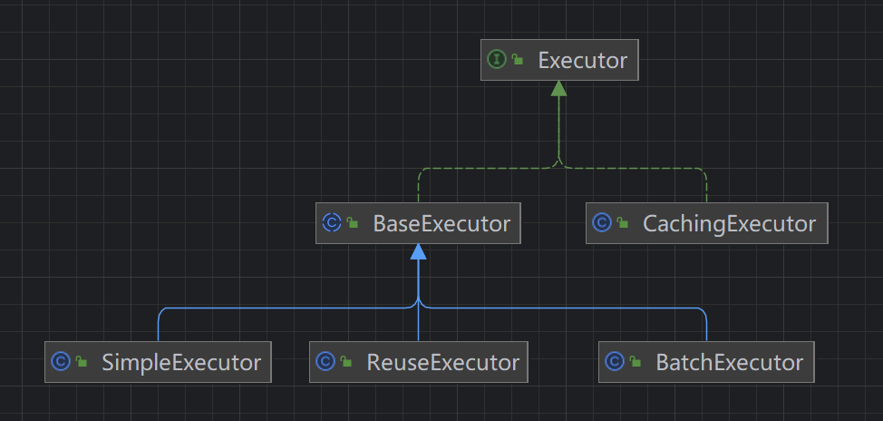

缓存可以减少不必要的资源访问，让查询从远端访问提升到近端获取，提高了系统性能。MyBatis 的**一级缓存**作用域是 SqlSession 级别的，每当我们开启一个数据库会话，短时间内访问同一份数据都是一样的。PS：但是在事务提交后，一级缓存会被清空，所以如果存在独立事务的需求，内部一级缓存是无法共享的

CachingExecutor 是一个独立的实现，他基于 Executor 实现了**二级缓存**功能，从 SqlSessionFactory.openSession 源码里可以得到 CachingExecutor 的创建过程

```java
public class DefaultSqlSessionFactory implements SqlSessionFactory {
	@Override
  	public SqlSession openSession() {
  		// 1.进入方法
    	return openSessionFromDataSource(configuration.getDefaultExecutorType(), null, false);
  	}
}
private SqlSession openSessionFromDataSource(ExecutorType execType, TransactionIsolationLevel level, boolean autoCommit) {
    Transaction tx = null;
    try {
      	final Environment environment = configuration.getEnvironment();
      	final TransactionFactory transactionFactory = getTransactionFactoryFromEnvironment(environment);
      	tx = transactionFactory.newTransaction(environment.getDataSource(), level, autoCommit);
        // 2.此处创建了Executor
      	final Executor executor = configuration.newExecutor(tx, execType);
      	return new DefaultSqlSession(configuration, executor, autoCommit);
    } catch (Exception e) {
      	closeTransaction(tx); // may have fetched a connection so lets call close()
      	throw ExceptionFactory.wrapException("Error opening session.  Cause: " + e, e);
    } finally {
      	ErrorContext.instance().reset();
    }
}
public class Configuration {
	public Executor newExecutor(Transaction transaction, ExecutorType executorType) {
    	executorType = executorType == null ? defaultExecutorType : executorType;
    	executorType = executorType == null ? ExecutorType.SIMPLE : executorType;
    	Executor executor;
        // 3.根据执行器类型创建对应的实现类
    	if (ExecutorType.BATCH == executorType) {
      		executor = new BatchExecutor(this, transaction);
    	} else if (ExecutorType.REUSE == executorType) {
      		executor = new ReuseExecutor(this, transaction);
    	} else {
      		executor = new SimpleExecutor(this, transaction);
    	}
        // 4.如果开启缓存，将上一步创建的执行器通过CachingExecutor的构造函数传入并返回
    	if (cacheEnabled) {
      		executor = new CachingExecutor(executor);
    	}
    	executor = (Executor) interceptorChain.pluginAll(executor);
    	return executor;
  	}
}
```

MyBatis 默认是开启二级缓存的，但是实际使用还需要在 mapper.xml 内添加 `<cache />` 标签，缓存配置如下：

- eviction 清除策略

  - LRU – 最近最少使用：移除最长时间不被使用的对象
  - FIFO – 先进先出：按对象进入缓存的顺序来移除它们
  - SOFT – 软引用：基于垃圾回收器状态和软引用规则移除对象
  - WEAK – 弱引用：更积极地基于垃圾收集器状态和弱引用规则移除对象

- flushInterval 刷新间隔（单位毫秒）：默认不设置即没有刷新间隔，只在调用时刷新

- size 最大缓存数量：**需要注意数量并不代表缓存大小，大缓存的存在可能超出内容使用预期**

- readOnly 只读模式：区别在于从缓存中取出来的是相同实例 or 序列化对象，后者会慢一点，但更加安全

  **如何理解这个安全呢？**因为从缓存中取出来的是相同的实例，当其中一位访问者修改了实例数据，那么其他访问者的数据也会随之变动，如果后者对实例进行了持久化，这会在不经意间导致意料外的数据更新！

### 分页

1.基于 RowBounds 实现（逻辑分页）

PS：Mybatis Mapper 代理类的功能，如果使用 SqlSession.selectList 是无法触发 RowBounds 的

使用方式：在 mapper.class 的方法参数中传入 RowBounds 即可

```java
List<User> queryPage(RowBounds rowBounds);
```

通过对结果集的处理源码递进跟踪，最终落到了 DefaultResultSetHandler.class

```java
private void handleRowValuesForSimpleResultMap(ResultSetWrapper rsw, ResultMap resultMap, ResultHandler<?> resultHandler, RowBounds rowBounds, ResultMapping parentMapping) throws SQLException {
    DefaultResultContext<Object> resultContext = new DefaultResultContext<>();
    ResultSet resultSet = rsw.getResultSet();
    // 根据 RowBounds.offset 参数跳过页前的数据
    skipRows(resultSet, rowBounds);
    // shouldProcessMoreRows 根据 RowBounds.limit 参数逐一循环判断
    while (shouldProcessMoreRows(resultContext, rowBounds) && !resultSet.isClosed() && resultSet.next()) {
        ResultMap discriminatedResultMap = resolveDiscriminatedResultMap(resultSet, resultMap, null);
        Object rowValue = getRowValue(rsw, discriminatedResultMap, null);
        // storeObject 将每一次循环的结果集存在了 ResultHandler 类中，供后续提取
        storeObject(resultHandler, resultContext, rowValue, parentMapping, resultSet);
    }
}
```

2.基于 PageHelper 插件实现（物理分页）

官方文档：https://github.com/pagehelper/Mybatis-PageHelper/blob/master/wikis/zh/HowToUse.md

使用方式：

1）引入依赖

```xml
<dependency>
   <groupId>com.github.pagehelper</groupId>
   <artifactId>pagehelper</artifactId>
</dependency>
```

2）在 mybatis-config.xml 配置文件中添加 plugin

```xml
<plugins>
   <!-- 分页插件 -->
   <plugin interceptor="com.github.pagehelper.PageInterceptor">
       <!-- 参数合理化：pageNum<=0 时会查询第一页， pageNum>pages（超过总数时），会查询最后一页。默认false 时，直接根据参数进行查询 -->
       <property name="reasonable" value="true"/>
   </plugin>
</plugins>
```

3）实战演示

```java
// mapper 接口方法调用（推荐）
PageHelper.startPage(1, 1);
Page<User> users = mapper.queryPageByPlugin();
// ISelect 接口方法调用
Page<User> users = PageHelper.startPage(1, 1).doSelectPage(mapper::queryPageByPlugin);
```

PS：Page 类是 ArrayList 的子类，即使 mapper 返回类型为 List，实际类型也是 Page。ISelect 接口方式可以讲声明范围 List 类型转为 Page 类型

### Demo

1）引入依赖

```xml
<dependency>
    <groupId>mysql</groupId>
    <artifactId>mysql-connector-java</artifactId>
    <version>8.0.21</version>
</dependency>
<dependency>
    <groupId>org.mybatis</groupId>
    <artifactId>mybatis</artifactId>
    <version>3.5.6</version>
</dependency>
<dependency>
    <groupId>junit</groupId>
    <artifactId>junit</artifactId>
    <version>4.13</version>
</dependency>
```

2）创建实体和映射文件

User.class

```java
@Data
public class User {
    private Long id;
    private String name;
    private LocalDate birthday;
}
```

UserMapper.xml（需要对应创建一个 UserMapper.class）

```xml
<?xml version="1.0" encoding="UTF-8"?>
<!DOCTYPE mapper 
        PUBLIC "-//mybatis.org//DTD Mapper 3.0//EN" 
        "http://mybatis.org/dtd/mybatis-3-mapper.dtd">
<mapper namespace="com.slm.mybatis.mapper.UserMapper">
</mapper>
```

3）编写配置文件

database.properties

```properties
db.driver = com.mysql.cj.jdbc.Driver
db.url = jdbc:mysql://localhost:3306/bsp
db.username = root
db.password = 123456
```

mybatis-config.xml

```xml
<?xml version="1.0" encoding="UTF-8" ?>
<!DOCTYPE configuration
        PUBLIC "-//mybatis.org//DTD Config 3.0//EN"
        "http://mybatis.org/dtd/mybatis-3-config.dtd">
<!-- configuration核心配置文件 -->
<configuration>
    <!-- 引入数据库配置 -->
    <properties resource="database.properties" />
    <!-- Mybatis 设置 -->
    <settings>
        <setting name="mapUnderscoreToCamelCase" value="true"/>
    </settings>
    <environments default="development">
        <environment id="development">
            <transactionManager type="JDBC"/>
            <!-- 数据源 -->
            <dataSource type="POOLED">
                <property name="driver" value="${db.driver}"/>
                <property name="url" value="${db.url}"/>
                <property name="username" value="${db.username}"/>
                <property name="password" value="${db.password}"/>
            </dataSource>
        </environment>
    </environments>
    <!-- Mapper 注册 -->
    <mappers>
        <mapper resource="mapper/UserMapper.xml" />
    </mappers>
</configuration>
```

4）加载 MyBatis 配置文件并访问数据库，以下是 CURD 演示

**select 查询**

UserMapper.class

```java
@Mapper
public interface UserMapper {
    User getUserById(Long id);
}
```

UserMapper.xml

```xml
<?xml version="1.0" encoding="UTF-8"?>
<!DOCTYPE mapper 
        PUBLIC "-//mybatis.org//DTD Mapper 3.0//EN" 
        "http://mybatis.org/dtd/mybatis-3-mapper.dtd">
<mapper namespace="com.slm.mybatis.mapper.UserMapper">
    <select id="getUserById" resultType="com.slm.mybatis.entity.User">
        select * from user where id = #{id}
    </select>
</mapper>
```

SelectTest.class

```java
@Test
public void demo() throws IOException {
    String resource = "mybatis-config.xml";
    InputStream inputStream = Resources.getResourceAsStream(resource);
    SqlSessionFactory sqlSessionFactory = new SqlSessionFactoryBuilder().build(inputStream);
    try(SqlSession sqlSession = sqlSessionFactory.openSession()) {
        User user = sqlSession.selectOne("com.slm.mybatis.mapper.UserMapper.getUserById", 1);
        System.out.println(user);
    }
}
------------------------------
User(id=1, name=root, birthday=2024-08-12)
```

SqlSession 的默认实现是 DefaultSqlSession，`SqlSession.selectOne` 内部还是使用的 selectList，只是对条数进行的校验，然后交由 Executor 执行

分页对象 RowBounds：参数同 limit 关键字

```java
public RowBounds(int offset, int limit) {
	this.offset = offset;
    this.limit = limit;
}
```

分页使用方式：SqlSession 接口方法 `public <E> List<E> selectList(String statement, Object parameter, RowBounds rowBounds)`

**insert 插入**

```java
@Mapper
public interface UserMapper {
    User insertUser(User user);
}
```

UserMapper.xml

```xml
<?xml version="1.0" encoding="UTF-8"?>
<!DOCTYPE mapper 
        PUBLIC "-//mybatis.org//DTD Mapper 3.0//EN" 
        "http://mybatis.org/dtd/mybatis-3-mapper.dtd">
<mapper namespace="com.slm.mybatis.mapper.UserMapper">
    <!-- 开启数据库自增ID并返回对象 -->
    <insert id="insertUser" parameterType="com.slm.mybatis.entity.User" useGeneratedKeys="true" keyProperty="id">
        insert into user (name, birthday) values (#{name}, #{birthday})
    </insert>
</mapper>
```

InsertTest.class

```java
@Test
public void insert() throws IOException {
    String resource = "mybatis-config.xml";
    InputStream inputStream = Resources.getResourceAsStream(resource);
    SqlSessionFactory sqlSessionFactory = new SqlSessionFactoryBuilder().build(inputStream);
    try(SqlSession sqlSession = sqlSessionFactory.openSession()) {
        User user = new User();
        user.setName("蜡笔小新");
        user.setBirthday(LocalDate.of(2024, 1, 1));
        sqlSession.insert("com.slm.mybatis.mapper.UserMapper.insertUser", user);
        System.out.println(user.getId());
    }
}
------------------------------
1（数据库自增ID）
```

PS：此时查询数据库会发现数据实际并没有生成，查看日志发现触发了回滚

> Rolling back JDBC Connection [com.mysql.cj.jdbc.ConnectionImpl@c35172e]

我们只需要把事务提交即可

解决方式一：打开 SqlSession 时使用 SqlSessionFactory.openSession 的重载方法 `SqlSession openSession(boolean autoCommit);`

解决方式二：手动提交 SqlSession  的事务，执行 `sqlSession.commit();`

另外 SqlSession 方法需要使用 insert，如果使用和查询一样的 selectOne，不会触发 useGeneratedKeys 得到的自增 ID

**update 更新**

吸取插入时的教训，我们需要在更新时也关注事务情况。同时对于更新来说有一个重要的指标就是更新条数，如果目标效果超出或不及预期，那么实际 SQL 是有问题的，例如：更新主键为 1 的用户姓名，但是返回更新条数为 0，那么说明更新目标不存在即该执行是无效的。

SqlSession.update 可以返回受影响条数，获取它并依据实际业务判断是否符合预期

PS：受影响条数的判断可以用于免除更新前的对象查询确认，实际先查后更新与直接获取受影响条数效果是一样的，而且还可以保证更新的实际落位！

UserMapper.class

```java
@Mapper
public interface UserMapper {
    int updateUser(User user);
}
```

UserMapper.xml

```xml
<?xml version="1.0" encoding="UTF-8"?>
<!DOCTYPE mapper 
        PUBLIC "-//mybatis.org//DTD Mapper 3.0//EN" 
        "http://mybatis.org/dtd/mybatis-3-mapper.dtd">
<mapper namespace="com.slm.mybatis.mapper.UserMapper">
    <update id="updateUser" parameterType="com.slm.mybatis.entity.User">
        update user set name = #{name} where id = #{id}
    </update>
</mapper>
```

SelectTest.class

```java
@Test
public void update() throws IOException {
    String resource = "mybatis-config.xml";
    InputStream inputStream = Resources.getResourceAsStream(resource);
    SqlSessionFactory sqlSessionFactory = new SqlSessionFactoryBuilder().build(inputStream);
    try (SqlSession sqlSession = sqlSessionFactory.openSession(true)) {
        User user = new User();
        user.setId(1L);
        user.setName("蜡笔小新2");
        int num = sqlSession.update("com.slm.mybatis.mapper.UserMapper.updateUser", user);
        System.out.println("更新成功 " + (num == 1));
    }
}
------------------------------
更新成功 true
```

**delete 删除**

UserMapper.class

```java
@Mapper
public interface UserMapper {
    int deleteUserById(Long id);
}
```

UserMapper.xml

```xml
<?xml version="1.0" encoding="UTF-8"?>
<!DOCTYPE mapper 
        PUBLIC "-//mybatis.org//DTD Mapper 3.0//EN" 
        "http://mybatis.org/dtd/mybatis-3-mapper.dtd">
<mapper namespace="com.slm.mybatis.mapper.UserMapper">
    <delete id="deleteUserById">
        delete from user where id = #{id}
    </delete>
</mapper>
```

SelectTest.class

```java
@Test
public void demo() throws IOException {
    String resource = "mybatis-config.xml";
    InputStream inputStream = Resources.getResourceAsStream(resource);
    SqlSessionFactory sqlSessionFactory = new SqlSessionFactoryBuilder().build(inputStream);
    try (SqlSession sqlSession = sqlSessionFactory.openSession(true)) {
        int num = sqlSession.delete("com.slm.mybatis.mapper.UserMapper.deleteUserById", 2);
        System.out.println("删除成功 " + (num == 1));
    }
}
------------------------------
删除成功 true
```

**RowBounds 分页**

```java
/**
 * 基于 RowBounds 实现（逻辑分页）
 *
 * @throws IOException
 */
@Test
public void rowBoundsPage() throws IOException {
    String resource = "mybatis-config.xml";
    InputStream inputStream = Resources.getResourceAsStream(resource);
    SqlSessionFactory sqlSessionFactory = new SqlSessionFactoryBuilder().build(inputStream);
    try (SqlSession sqlSession = sqlSessionFactory.openSession()) {
        UserMapper mapper = sqlSession.getMapper(UserMapper.class);
        List<User> users = mapper.queryPage(new RowBounds(1, 10));
        System.out.println("user " + users);
    }
}
```

## Mybatis Spring

### 注册映射文件

#### 手动注册

MapperFactoryBean

```xml
<bean id="userMapper" class="org.mybatis.spring.mapper.MapperFactoryBean">
  <property name="mapperInterface" value="org.mybatis.spring.sample.mapper.UserMapper" />
  <property name="sqlSessionFactory" ref="sqlSessionFactory" />
</bean>
```

mapperFactoryBean 是一个 FactoryBean，通过接口方法 T getObject() 生成实际注入的 Bean，内容和原始 Mybatis 映射文件使用方式一样的，从 SqlSession 获取

```java
@Override
public T getObject() throws Exception {
    return getSqlSession().getMapper(this.mapperInterface);
}
```

#### 包扫描

让 mybatis-spring 对类路径进行扫描发现

1. 使用 `<mybatis:scan basePackage='com.xxx'>` 元素

   mybatis:scan 是来自于 mybatis-spring 依赖下的 /META-INF/spring.handlers 内的 NamespaceHandler，里面标注了 scan 对应的处理类，内部注册了 MapperScannerConfigurer 类并注入了 scan 元素的 basePackage 属性

2. 在配置类添加 `@MapperScan('com.xxx')` 注解

   @MapperScan 注解头部有一个@Import，导入了 MapperScannerRegistrar 类，内部走接口 ImportBeanDefinitionRegistrar 的实现方法 registerBeanDefinitions 注册了 MapperScannerConfigurer

3. 注册 `MapperScannerConfigurer` bean 执行扫描过程

前两种底层都是通过 MapperScannerConfigurer 实现的，mapperScannerConfigurer 内部对 basePackage 包进行了接口类扫描，然后将扫描出来 BeanDefinition 替换成 MapperFactoryBean 搞定！

### SqlSessionFactoryBean

使用 Spring FactoryBean 机制生成 SqlSessionFactory

**什么是 FactoryBean ？**

讲到 FactoryBean 就离不开他的兄弟 BeanFactory，两者名称很相似

- BeanFactory 是 IOC 容器的核心接口，用来管理和获取容器中的 Bean 实例，比如我们熟悉的 Spring 上下文加载类 ClassPathXmlApplicationContext
- FactoryBean 是一个特殊的 Bean，用来创建和管理其他的 Bean 实例。FactoryBean 定义创建 Bean 的方式，允许开发人员在 Bean 的创建过程中进行额外的处理。当我们需要动态的配置我们的 Bean，FactoryBean 就是一个不二之选

PS：如果你需要通过 BeanFactory 获取 FactoryBean 生成的 Bean 的工厂对象，可以在 BeanName 前面加一个 & 来获取

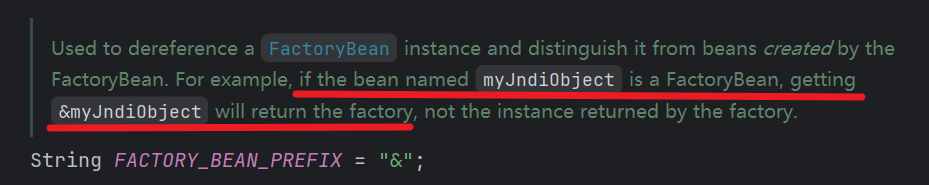

SqlSessionFactoryBean 就是一个 FactoryBean，他的接口方法  getObject 的泛型就是 SqlSessionFactory，内部对配置进行拼装处理然后交给 sqlSessionFactoryBuilder 进行 build，这一步和我们自己创建 SqlSessionFactory 是一样的

FactoryBean 在 Spring 中最典型的应用就是 AOP 代理，在运行时通过反射机制创建代理对象，并向代理对象织入逻辑增强，这个对象就是 —— ProxyFactoryBean

参考资料：

[1]:https://zhuanlan.zhihu.com/p/97005407	"Spring FactoryBean"
[2]:https://blog.csdn.net/belongtocode/article/details/134631544	"BeanFactory 和 FactoryBean"

### SqlSessionTemplate

线程安全并且集成 Spring 事务

#### Spring 事务

> 在多用户并发操作和[大数据](https://cloud.tencent.com/solution/bigdata?from_column=20065&from=20065)处理的现代软件开发领域中，事务管理已成为确保数据一致性和完整性的关键技术之一。特别是在使用如Spring这样的全面框架时，理解和掌握其事务管理机制不仅有助于我们编写出更为健壮和高效的应用，还能帮助我们避免一些由于事务处理不当带来的问题，如数据不一致性、数据丢失等。（via https://cloud.tencent.com/developer/article/2333618）

##### 事务特性（ACID）

- *原子性（Atomicity）*：事务是最小的执行单位，不允许分割。事务的原子性确保动作要么全部完成，要么完全不起作用
- *一致性（Consistency）*：执行事务前后，数据保持一致，例如转账业务中，无论事务是否成功，转账者和收款人的总额应该是不变的
- *隔离性（Isolation）*：并发访问数据库时，一个用户的事务不被其他事务所干扰，各并发事务之间数据库是独立的
- *持久性（Durability）*：一个事务被提交之后。它对数据库中数据的改变是持久的，即使数据库发生故障也不应该对其有任何影响

PS：程序是否支持事务取决于数据库！

##### 事务传播行为

> 事务传播行为是为了解决业务层方法之间互相调用的事务问题

常见行为列表：

1. *TransactionDefinition.PROPAGATION_REQUIRED*（默认）：支持当前事务，如果没有则新建一个事务。类似于可重复锁，可重复进入
2. *TransactionDefinition.PROPAGATION_REQUIRES_NEW*：创建一个新事务，**如果当前存在事务，则挂起当前事务**。
3. *TransactionDefinition.PROPAGATION_MANDATORY*：加入当前事务，如果不存在事务则报错
4. *TransactionDefinition.PROPAGATION_NESTED*
   - 如果外部存在事务则作为嵌套事务存在
   - 如果外部没有事务则单独开启事务，类似 PROPAGATION_REQUIRED

PS：嵌套事务在回滚时上下层事务均会回滚，但区别在于子事务可以通过 try cache 捕获不让父事务回滚

##### 事务隔离级别

1. *Isolation.DEFAULT*：默认级别
2. *Isolation.READ_UNCOMMITTED*：未提交读
3. *Isolation.READ_COMMITTED*：提交读
4. *Isolation.REPEATABLE_READ*：可重复读
5. *Isolation.SERIALIZABLE*：序列化

事务隔离面临的问题：

- 脏读：事务内读到了**其他事务回滚前提交的数据**
- 不可重复读：事务内两次**读取的数据不一致**，在两次查询过程中插入了其他事务更新的数据
- 幻读（又称幻影行）：一个事务中两次**查询到的数据笔数不一致**

事务隔离级别与存在问题的对照表

| 隔离级别         | 脏读 | 不可重复读 | 幻读 |
| ---------------- | ---- | ---------- | ---- |
| READ_UNCOMMITTED | √    | √          | √    |
| READ_COMMITTED   | ×    | √          | √    |
| REPEATABLE_READ  | ×    | ×          | √    |
| SERIALIZABLE     | ×    | ×          | ×    |

PS：MySQL InnoDB 存储引擎的默认支持的隔离级别是 **REPEATABLE-READ（可重读）**

##### 事务管理方式

事务相关接口

- *TransactionManager*（PlatformTransactionManager）：事务管理器，Spring 事务策略的核心，Spring 并不直接管理事务，而提供了各平台对应的事务管理器，如：JDBC（DataSourceTransactionManager）、Hibernate（HibernateTransactionManager）、JPA（JpaTransactionManager）。事务管理器的核心接口方法：

  ```java
  public interface PlatformTransactionManager extends TransactionManager {
      // 获取事务资源
      TransactionStatus getTransaction(@Nullable TransactionDefinition definition) throws TransactionException;
      // 提交事务
      void commit(TransactionStatus status) throws TransactionException;
      // 事务回滚
      void rollback(TransactionStatus status) throws TransactionException;
  }
  ```

- *TransactionDefinition*：事务定义信息（事务隔离级别、传播行为、超时、只读、回滚规则）

- *TransactionStatus*：事务运行状态（是否为新事务、只读，记录点等）

Spring 支持两种方式的事务管理

**编程式事务管理**

通过 TransactionManager 手动管理事务，实际应用中比较少

```java
/**
 * 编程式事务
 */
@Test
public void programmaticTransaction() {
    // 创建 Spring 上下文
    ClassPathXmlApplicationContext context = new ClassPathXmlApplicationContext("applicationContext.xml");
    // 获取 SqlSessionFactory
    SqlSessionFactory sqlSessionFactory = (SqlSessionFactory) context.getBean("sqlSessionFactory");
    // 获取 TransactionManager 事务管理器
    PlatformTransactionManager transactionManager = context.getBean(PlatformTransactionManager.class);
    // 创建事务
    TransactionStatus status = transactionManager.getTransaction(new DefaultTransactionDefinition());
    try (SqlSession sqlSession = sqlSessionFactory.openSession()) {
        AuthorMapper authorMapper = sqlSession.getMapper(AuthorMapper.class);
        Author author = authorMapper.findById(1L);

        BlogMapper blogMapper = sqlSession.getMapper(BlogMapper.class);
        Blog blog = new Blog();
        blog.setTitle("Spring 实战");
        blog.setAuthor(author);
        blog.setCreateTime(LocalDateTime.now());
        int flag = blogMapper.insert(blog);

        // 事务提交
        transactionManager.commit(status);
        log.info("新增成功 {} id = {}", flag == 1, blog.getId());
    } catch (Exception e) {
        // 报错回滚事务
        transactionManager.rollback(status);
    }
}
```

编程式事务的应用场景：事务内方法如果存在较耗时的操作会长时间占用 Connection 从而大大减少的连接的复用，导致高并发下性能降低。**主要目的是为了降低事务的粒度**

**声明式事务管理**

通过 AOP 实现，侵入性小推荐使用

事务核心注解 @Transactional

- @Transactional 实质是使用了 JDBC 的事务来进行事务控制的
- @Transactional 基于 Spring 的动态代理的机制

PS：注解只对 public 修饰的方法有效

常用配置参数：

| 属性        | 说明                                                         |
| ----------- | ------------------------------------------------------------ |
| propagation | 事务的传播行为，默认值为 REQUIRED                            |
| isolation   | 事务的隔离级别，默认值采用 DEFAULT                           |
| timeout     | 事务的超时时间，默认不会超时                                 |
| readOnly    | 指定事务是否为只读事务，默认值为 false                       |
| rollbackFor | 指定能够触发事务回滚的异常类型，默认回滚异常为 RuntimeException 和 Error，建议提升到 Exception |

@Transactional AOP 实现源码解析

*注解事务是在哪开启的？*

在 applicationContext.xml Spring 上下文配置文件里有这样一行：`<tx:annotation-driven />`，这就是注解事务支持的地方

1）如何解析 Spring 标签

功能来自 tx 标签，而引入这个标签的 schema 来自 spring-tx 模块，而每个标签在对应模块的 META-INF 下都有一份 spring.handlers 文件，里面存放了对应命名空间下可选元素的处理器

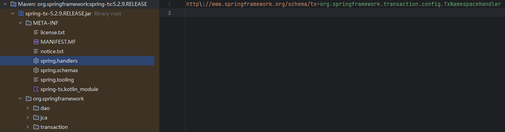

进入 TxNamespaceHandler 就会发现在类初始化的时候注册了可选元素的名称

```java
public class TxNamespaceHandler extends NamespaceHandlerSupport {
	@Override
	public void init() {
		registerBeanDefinitionParser("advice", new TxAdviceBeanDefinitionParser());
		registerBeanDefinitionParser("annotation-driven", new AnnotationDrivenBeanDefinitionParser());
		registerBeanDefinitionParser("jta-transaction-manager", new JtaTransactionManagerBeanDefinitionParser());
	}
}
```

annotation-driven BeanDefinition（AnnotationDrivenBeanDefinitionParser） 注册过程中生成了一个核心 BeanPostProcessor —— InfrastructureAdvisorAutoProxyCreator.class

2）借助 Spring 上下文加载对 BeanPostProcessor 的前置处理 postProcessBeforeInstantiation，对类进行了代理，其中添加了一个同样是在 AnnotationDrivenBeanDefinitionParser 中定义的 Bean BeanFactoryTransactionAttributeSourceAdvisor，这是一个 Advisor 实现，对所代理的方法进行的通知事务增强，增强类为 TransactionInterceptor

```java
public class TransactionInterceptor extends TransactionAspectSupport implements MethodInterceptor, Serializable {
    @Override
	@Nullable
	public Object invoke(MethodInvocation invocation) throws Throwable {
		Class<?> targetClass = (invocation.getThis() != null ? AopUtils.getTargetClass(invocation.getThis()) : null);
		return invokeWithinTransaction(invocation.getMethod(), targetClass, invocation::proceed);
	}
    @Nullable
	protected Object invokeWithinTransaction(Method method, @Nullable Class<?> targetClass,
			final InvocationCallback invocation) throws Throwable {
    	PlatformTransactionManager ptm = asPlatformTransactionManager(tm);
		if (txAttr == null || !(ptm instanceof CallbackPreferringPlatformTransactionManager)) {
            // 根据事务传播行为创建事务
			TransactionInfo txInfo = createTransactionIfNecessary(ptm, txAttr, joinpointIdentification);

			Object retVal;
			try {
				// 执行方法
				retVal = invocation.proceedWithInvocation();
			}
			catch (Throwable ex) {
				// 事务回滚
				completeTransactionAfterThrowing(txInfo, ex);
				throw ex;
			}
			finally {
				cleanupTransactionInfo(txInfo);
			}
            // 如果成功走到这里就代表没有报错，可以提交事务
			commitTransactionAfterReturning(txInfo);
			return retVal;
		}
    }
}
```

##### 事务逻辑梳理图

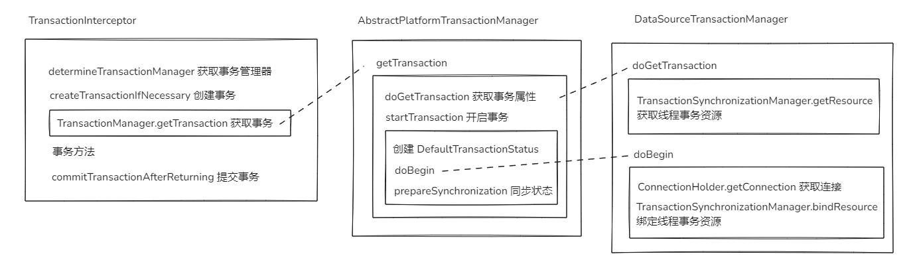

**注意事项**

- @Transactional 必须用在 public 修复的方法上
- 事务建议用在调用链顶层方法上，非事务方法调用事务方法必须基于 AOP代理，即 Spring Bean 方法触发，例如：this.method() 就不是 AOP 代理调用
- 通过 @Async 开启的多线程并不会被 Spring 事务管理，需要手动添加 @Transactional 注解事务支持

参考资料：

[1]:https://javaguide.cn/system-design/framework/spring/spring-transaction.html	"Spring 事务详解"
[2]:https://javaguide.cn/database/mysql/transaction-isolation-level.html	"MySQL事务隔离级别详解"
[3]:https://blog.csdn.net/qq_42352936/article/details/126151308	"事务嵌套 、事务挂起、事务传播特性"
[4]:https://blog.csdn.net/WLQ0621/article/details/107714754	"Spring声明式事务和编程式事务的原理及使用场景"
[5]:https://blog.csdn.net/m0_45406092/article/details/115436325	"Spring 标签解析"
[6]:https://blog.csdn.net/jiangyu1013/article/details/84397366	"声明式事务注意事项"

#### 如何注入到 Mapper 代理类中

MapperFactoryBean 类使用了 AUTOWIRE_BY_TYPE 模式自动装载 SqlSessionTemplate 属性，如果手动注册 Bean 自然不用多说，但实际默认是可以自动生成的！MapperFactoryBean 继承自 SqlSessionDaoSupport 抽象类，内部在注入 sqlSessionFactory 时会对 sqlSessionTemplate 进行检查，如果没有则根据 sqlSessionFactory 创建一个默认的 SqlSessionTemplate

#### TransactionSynchronizationManager

主要属性：

- `ThreadLocal<Map<Object, Object>> resources`：事务资源，存储每个事务内的 *ConnectionHolder* 用于获取同一个 Connection 连接
- `ThreadLocal<Set<TransactionSynchronization>> synchronizations`：事务同步，对于存在需要事务同步的情况，把同步操作注册在该集合内，在事务操作的前后 Commit 和 Completion 操作内进行触发

常见事务同步注册方式：

1. 直接通过 TransactionSynchronizationManager 静态方法注册

```java
TransactionSynchronizationManager.registerSynchronization(new TransactionSynchronizationAdapter() {
    @Override
    public void afterCommit() {
        producer.sendMessageAync(NOTIFY, vo.getShopMdCode());
    }
});
```

2. Spring 事件监听

```java
@TransactionalEventListener(phase = TransactionPhase.AFTER_COMMIT)
public void eventProcess() {}
```

由于 TransactionSynchronizationManager 的属性基于 ThreadLocal 存储，故他们都是线程隔离的，所以 SqlSessionTemplate 在进行事务操作是线程安全的

PS：当出现事务传播遇到 PROPAGATION_REQUIRES_NEW 的情况，TransactionSynchronizationManager 记录的当前线程事务属性将会被挂起暂存，事务同步都关联于发布同步时的事务，起到了同步事务隔离！

#### 事务交由 Spring 管理

##### 事务工厂

MyBatis 的事务是在 SqlSessionFactory.openSession() 时打开的，根据源码跟进最后发现事务产出自 TransactionFactory，在纯 MyBatis 开发时 mybatis-config 文件内[环境](#mybatis-config.environments)配置时就设定了事务类型

```java
private TransactionFactory transactionManagerElement(XNode context) throws Exception {
    if (context != null) {
        String type = context.getStringAttribute("type");
        Properties props = context.getChildrenAsProperties();
        // 根据 transactionManager 标签的 type 属性实例化指定的 TransactionFactory
        TransactionFactory factory = (TransactionFactory) resolveClass(type).getDeclaredConstructor().newInstance();
        factory.setProperties(props);
        return factory;
    }
    throw new BuilderException("Environment declaration requires a TransactionFactory.");
}
```

MyBatis Spring 的 SqlSessionFactory 是交由 SqlSessionFactoryBean 生成的，而该类工作的必要参数只有 dataSource，所以上述环境配置为默认配置，通过查阅源码 SqlSessionFactory  生成过程时可以看到这样一行

```java
targetConfiguration.setEnvironment(new Environment(this.environment, (TransactionFactory)(this.transactionFactory == null ? new SpringManagedTransactionFactory() : this.transactionFactory), this.dataSource));
```

对 transactionFactory 缺省值，Spring 使用了 SpringManagedTransactionFactory

##### 使用 Spring 事务

MyBatis-Spring 映射类均使用 MapperFactoryBean 生成代理，代理增强为 MapperProxy

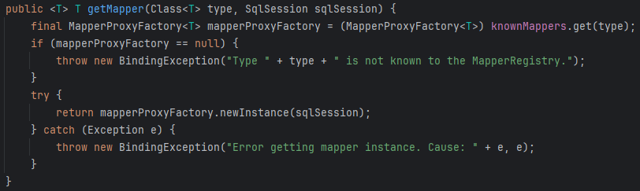

<center>
    MapperRegistry.getMapper
</center>

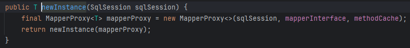

<center>
    MapperProxyFactory.newInstance
</center>
MapperProxy 持有了传入的 SqlSession，即 SqlSessionTemplate。在实际 SQL 运行时，SqlSessionTemplate 使用的时内部生成的执行代理类 sqlSessionProxy，该代理类使用了 SqlSessionInterceptor 拦截器

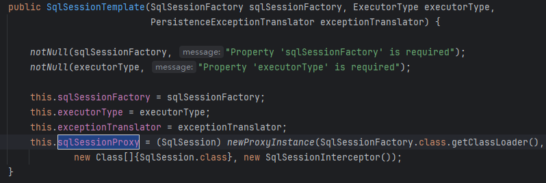

在 SqlSessionInterceptor 拦截器内部使用 SqlSessionFactory 获取事务得到上一步的事务工厂生成了 Spring 事务并封装入 DefaultSqlSession

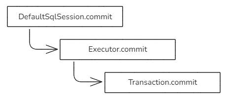

<center>
    事务提交过程
</center>

#### 事务与各组件联动

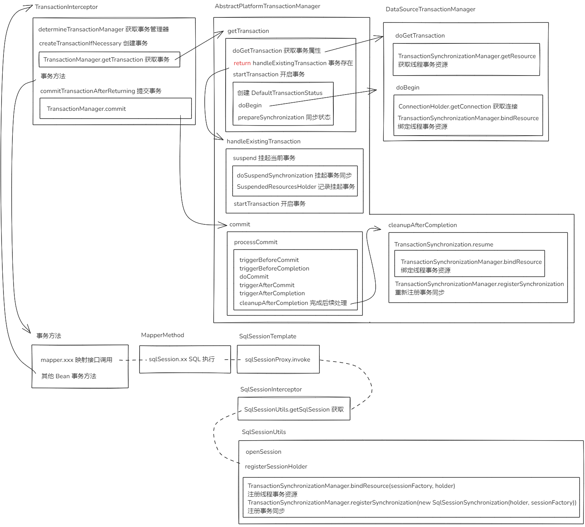

## Spring Boot 集成 Mybatis

### SPI 机制

SPI 即 Service Provider Interface（服务提供者接口）：是 JDK 内置的一种服务提供发现机制，为服务提供者暴露的接口规范

SPI 将服务接口和具体的服务实现分离开来，将服务调用方和服务实现者解耦，能够提升程序的扩展性、可维护性

**SPI 和 API 的区别**

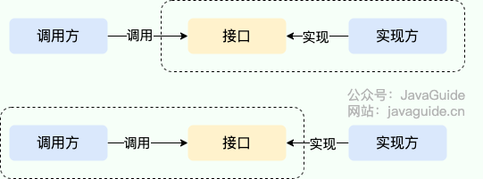

<center>
    API VS SPI
</center>

- 当实现方提供了接口和实现，我们可以通过调用实现方的接口从而拥有实现方给我们提供的能力，这就是 **API**。这种情况下，接口和实现都是放在实现方的包中。调用方通过接口调用实现方的功能，而不需要关心具体的实现细节。
- 当接口存在于调用方这边时，这就是 **SPI ** 。由接口调用方确定接口规则，然后由不同的厂商根据这个规则对这个接口进行实现，从而提供服务

**ServiceLoader SPI 实现**

1）定义一个接口

创建一个 provider-interface 模块并在内部创建 SPI 接口

```java
package com.test.spi;
public interface HelloSPI {
    void sayHello();
}
```

打包安装至本地 maven 仓库

模块目录结构

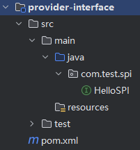

2）创建接口实现

创建一个实现模块01 - spi-provider-01

maven 引入 provider-interface 依赖并实现 SPI 接口

```java
package com.test.spi;
public class Provider01 implements HelloSPI {
    @Override
    public void sayHello() {
        System.out.println("I say hello");
    }
}

```

在 resources 下创建 /META-INF/services 文件夹，并在内部创建一个文件名为 SPI 接口全限定名的文件

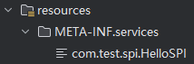

文件内容为实现类全限定名

```
com.test.spi.Provider01
```

遵照同理，创建实现模块02 - spi-provider-02

4）创建服务调用模块 service-invoke

引入 SPI 接口和实现模块

```xml
<?xml version="1.0" encoding="UTF-8"?>
<project xmlns="http://maven.apache.org/POM/4.0.0"
         xmlns:xsi="http://www.w3.org/2001/XMLSchema-instance"
         xsi:schemaLocation="http://maven.apache.org/POM/4.0.0 http://maven.apache.org/xsd/maven-4.0.0.xsd">
    <modelVersion>4.0.0</modelVersion>

    <groupId>com.test</groupId>
    <artifactId>java-spi</artifactId>
    <version>1.0-SNAPSHOT</version>

    <properties>
        <maven.compiler.source>11</maven.compiler.source>
        <maven.compiler.target>11</maven.compiler.target>
        <project.build.sourceEncoding>UTF-8</project.build.sourceEncoding>
    </properties>

    <dependencies>
        <dependency>
            <groupId>com.test</groupId>
            <artifactId>provider-interface</artifactId>
            <version>1.0-SNAPSHOT</version>
        </dependency>
        <dependency>
            <groupId>com.test</groupId>
            <artifactId>spi-provider-01</artifactId>
            <version>1.0-SNAPSHOT</version>
        </dependency>
        <dependency>
            <groupId>com.test</groupId>
            <artifactId>spi-provider-02</artifactId>
            <version>1.0-SNAPSHOT</version>
        </dependency>
    </dependencies>

</project>
```

使用 ServiceLoader 加载服务

```java
package com.test.spi;

import java.util.ArrayList;
import java.util.List;
import java.util.ServiceLoader;

public class SpiService {

    private final List<HelloSPI> services;

    public SpiService() {
        ServiceLoader<HelloSPI> loader = ServiceLoader.load(HelloSPI.class);
        services = new ArrayList<>();
        for (HelloSPI provider : loader) {
            services.add(provider);
        }
    }

    public void sayHello() {
        services.forEach(HelloSPI::sayHello);
    }

    public static void main(String[] args) {
        SpiService spiService = new SpiService();
        spiService.sayHello();
    }

}
-----------------------------------------------------------------
I say hello
You say hello
```

SPI 机制让服务与服务提供者进行了解耦，如果我们需要更换实现，只需要依赖不同的实现即可。调用方定义了接口并对实现类型进行指定，但对具体实现并不关心，由服务提供商来落实即可！

参考资料：

[1]:https://javaguide.cn/java/basis/spi.html	"Java SPI 机制详解"
[2]:https://zhuanlan.zhihu.com/p/84337883	"ServiceLoader SPI"

### Spring Boot 中的 SPI 机制

在 Spring 中也有一种类似与 Java SPI 的加载机制。在 /META-INF/spring.factories 文件中配置接口的实现类名称，然后在程序中读取这些配置文件并实例化，这种自定义的SPI机制是 Spring Boot Starter 实现的基础

Spring Factories 实现原理

spring-core 包里定义了 SpringFactoriesLoader 类，这个类实现了检索 META-INF/spring.factories 文件，并获取指定接口的配置的功能

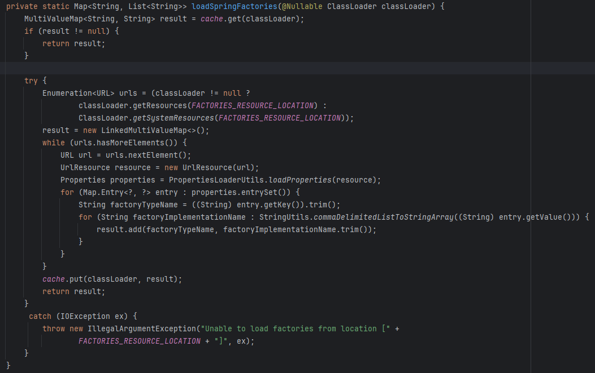

<center>
    SpringFactoriesLoader.loadSpringFactories
</center>

在 Spring Boot 的很多包中都能够找到 spring.factories 文件，例如：mybatis-spring-boot-starter

```
# Auto Configure
org.springframework.boot.env.EnvironmentPostProcessor=\
  com.baomidou.mybatisplus.autoconfigure.SafetyEncryptProcessor
org.springframework.boot.autoconfigure.EnableAutoConfiguration=\
  com.baomidou.mybatisplus.autoconfigure.MybatisPlusLanguageDriverAutoConfiguration,\
  com.baomidou.mybatisplus.autoconfigure.MybatisPlusAutoConfiguration
```

参考资料：

[1]:https://www.cnblogs.com/zt007/p/17118514.html	"spring.factories文件的作用详解"

### Spring Boot 自动装配

> Spring Boot的自动装配实际上是从 /META-INF/spring.factories 文件中获取到对应的需要进行自动装配的类，并生成相应的Bean对象，然后将它们交给Spring容器进行管理。

**SpringBoot 是如何实现自动装配的？**

SpringBoot 的核心注解 @SpringBootApplication 由三个子注解组成

- @SpringBootConfiguration：组合了 @Configuration 注解，实现配置文件的功能
- @EnableAutoConfiguration：启用 SpringBoot 的自动配置机制
- @ComponentScan：Spring 组件扫描功能，默认会扫描启动类所在的包下所有的类

**@EnableAutoConfiguration** 自动装配

- @AutoConfigurationPackage 指定了默认的包规则，将主程序类所在包及所有子包下的组件扫描到Spring容器中

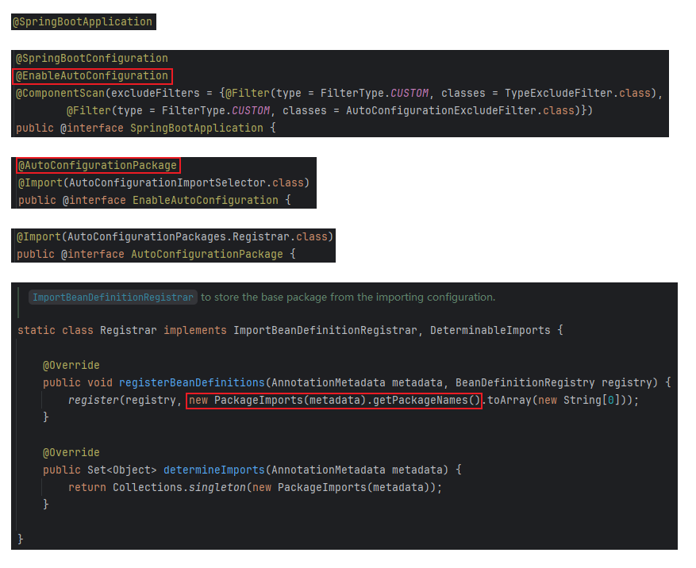

<center>
    Spring Boot 默认包规则
</center>

- @Import(AutoConfigurationImportSelector.class) 
  1. 利用 getAutoConfigurationEntry 给容器中批量导入一些组件
  2. 调用 getCandidateConfigurations 获取到所有需要导入到容器中的配置类
  3. 利用工厂加载 Map<String, List> loadSpringFactories 得到所有的组件
  4. 从 classpath:/META-INF/spring.factories 位置加载文件并解析所有配置

**条件装配**

⭐**核心注解 @Conditional**：通过条件来控制bean的注册

通过 @Conditional 注解可以配置一些条件判断，当所有条件都满足的时候，被 @Conditional 标注的目标才会被 Spring 容器处理

```java
@Target({ElementType.TYPE, ElementType.METHOD})
@Retention(RetentionPolicy.RUNTIME)
@Documented
public @interface Conditional {

	/**
	 * All {@link Condition} classes that must {@linkplain Condition#matches match}
	 * in order for the component to be registered.
	 */
	Class<? extends Condition>[] value();

}
```

Condition 接口：表示条件判断的接口

```java
@FunctionalInterface
public interface Condition {

	/**
	 * Determine if the condition matches.
	 * @param context the condition context
	 * @param metadata the metadata of the {@link org.springframework.core.type.AnnotationMetadata class}
	 * or {@link org.springframework.core.type.MethodMetadata method} being checked
	 * @return {@code true} if the condition matches and the component can be registered,
	 * or {@code false} to veto the annotated component's registration
	 */
	boolean matches(ConditionContext context, AnnotatedTypeMetadata metadata);

}
```

- context：容器上下文信息
- metadata：标注对象的注解信息

**Spring Boot 常见条件注解**

[Spring 官网解释](https://docs.spring.io/spring-boot/reference/features/developing-auto-configuration.html#features.developing-auto-configuration.condition-annotations)

注解所在包 org.springframework.boot.autoconfigure.condition

-  Class Conditions：@ConditionalOnClass 当项目中存在某个类时才会使标有该注解的类或方法生效，@ConditionalOnMissingClass 反之

-  Bean Conditions：@ConditionalOnBean 当 Bean 存在时生效，@ConditionalOnMissingBean 反之

- Property Conditions：@ConditionalOnProperty 当配置存在时生效

  > @ConditionalOnProperty(prefix = "notification", name = "service")

- Resource Conditions：@ConditionalOnResource 当资源存在时生效

  > @ConditionalOnResource(resources = "classpath:myconfig.properties")

- SpEL Expression Conditions：@ConditionalOnExpression 

  > @ConditionalOnExpression("#{!'true'.equals(environment.getProperty('conditional.express'))}")
  >

PS：Spring Boot 自动装配包 spring-boot-autoconfigure，默认实现了底层的诸多组件，但是***基于条件装配用户优先***

### MybatisAutoConfiguration

```java
@Configuration
@ConditionalOnClass({ SqlSessionFactory.class, SqlSessionFactoryBean.class })
@ConditionalOnSingleCandidate(DataSource.class)
@EnableConfigurationProperties(MybatisProperties.class)
@AutoConfigureAfter({ DataSourceAutoConfiguration.class, MybatisLanguageDriverAutoConfiguration.class })
public class MybatisAutoConfiguration implements InitializingBean {}
```

重要的元素：

- SqlSessionFactory 和 SqlSessionFactoryBean，这两个是用来创建 SqlSession的，依赖 mybatis-spring-boot-starter 自带了这两个类所在的 mybatis 和 mybatis-spring 依赖，所以条件必然符合

  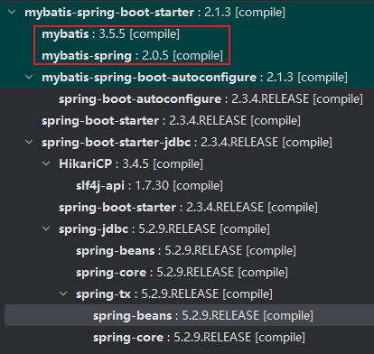

- DataSource 数据源，改类来自于 spring-boot-autoconfigure 组件自动装配，装配条件是引入了 spring-jdbc 组件

- MybatisProperties yaml 配置

PS：自动装配类内定义了 SqlSessionFactory 和 sqlSessionTemplate，装载条件均为 @ConditionalOnMissingBean

**MapperScannerConfigurer**：包扫描配置

- 使用 @MapperScan 导入
- MybatisAutoConfiguration.MapperScannerRegistrarNotFoundConfiguration 兜底实现

参考资料：

[1]:https://javaguide.cn/system-design/framework/spring/spring-boot-auto-assembly-principles.html	"SpringBoot 自动装配原理详解"
[2]:https://blog.csdn.net/qq_41805567/article/details/129111183	"Spring Boot自动装配原理(易懂)"
[3]:https://blog.csdn.net/likun557/article/details/105108901	"@Conditional通过条件来控制bean的注册"

### Demo


1. 引入依赖

   ```xml
   <dependency>
       <groupId>mysql</groupId>
       <artifactId>mysql-connector-java</artifactId>
       <version>8.0.21</version>
   </dependency>
   <dependency>
       <groupId>org.mybatis.spring.boot</groupId>
       <artifactId>mybatis-spring-boot-starter</artifactId>
       <version>2.1.4</version>
   </dependency>
   ```

2. 配置 datasource

   ```yaml
   spring:
     datasource:
       driver-class-name: com.mysql.cj.jdbc.Driver
       url: jdbc:mysql://localhost:3306/bsp
       username: root
       password: 123456
   mybatis:
     mapper-locations: classpath:mapper/*.xml
     configuration:
       map-underscore-to-camel-case: true
   ```

3. mapper

   **接口文件**
   
   创建一个 mapper 接口文件，在类上加上 @Mapper 注解用于给 Mybatis 框架识别为映射类
   
   **配置文件**
   
   创建一份 mapper 配置文件，格式为 XML，下面是空文件示例：
   
   ```xml
   <?xml version="1.0" encoding="UTF-8"?>
   <!DOCTYPE mapper PUBLIC "-//mybatis.org//DTD Mapper 3.0//EN" "http://mybatis.org/dtd/mybatis-3-mapper.dtd">
   <mapper namespace="com.slm.mybatis.mapper.UserMapper">
   
   </mapper>
   ```
   
   **标签**
   
   mapper：必填属性 namespace 标注本映射文件对应的映射类是哪个
   
   select：查询操作，mybatis 使用的是 #{} 占位符，常用属性如下：
   
   | 常用属性      | 描述                                                         |
   | :------------ | :----------------------------------------------------------- |
   | id            | 在命名空间中唯一的标识符，可以被用来引用这条语句。           |
   | parameterType | 将会传入这条语句的参数的类全限定名或别名。这个属性是可选的，因为 MyBatis 可以根据语句中实际传入的参数计算出应该使用的类型处理器（TypeHandler），默认值为未设置（unset）。 |
   | resultType    | 期望从这条语句中返回结果的类全限定名或别名。 注意，如果返回的是集合，那应该设置为集合包含的类型，而不是集合本身的类型。 resultType 和 resultMap 之间只能同时使用一个。 |
   | resultMap     | 对外部 resultMap 的命名引用。结果映射是 MyBatis 最强大的特性，如果你对其理解透彻，许多复杂的映射问题都能迎刃而解。 resultType 和 resultMap 之间只能同时使用一个。 |
   | useCache      | 将其设置为 true 后，将会导致本条语句的结果被二级缓存缓存起来，默认值：对 select 元素为 true。 |

   insert、update、delete：增改删
   
   | 属性             | 描述                                                         |
   | :--------------- | :----------------------------------------------------------- |
   | id               | 在命名空间中唯一的标识符，可以被用来引用这条语句             |
   | parameterType    | 将会传入这条语句的参数的类全限定名或别名。这个属性是可选的，因为 MyBatis 可以根据语句中实际传入的参数计算出应该使用的类型处理器（TypeHandler），默认值为未设置（unset）。 |
   | flushCache       | 将其设置为 true 后，只要语句被调用，都会导致本地缓存和二级缓存被清空，默认值：（对 insert、update 和 delete 语句）true。 |
   | useGeneratedKeys | （仅适用于 insert 和 update）这会令 MyBatis 使用 JDBC 的 getGeneratedKeys 方法来取出由数据库内部生成的主键（比如：像 MySQL 和 SQL Server 这样的关系型数据库管理系统的自动递增字段），默认值：false。 |
   | keyProperty      | （仅适用于 insert 和 update）指定能够唯一识别对象的属性，MyBatis 会使用 getGeneratedKeys 的返回值或 insert 语句的 selectKey 子元素设置它的值，默认值：未设置（`unset`）。如果生成列不止一个，可以用逗号分隔多个属性名称。 |
   | keyColumn        | （仅适用于 insert 和 update）设置生成键值在表中的列名，在某些数据库（像 PostgreSQL）中，当主键列不是表中的第一列的时候，是必须设置的。如果生成列不止一个，可以用逗号分隔多个属性名称。 |