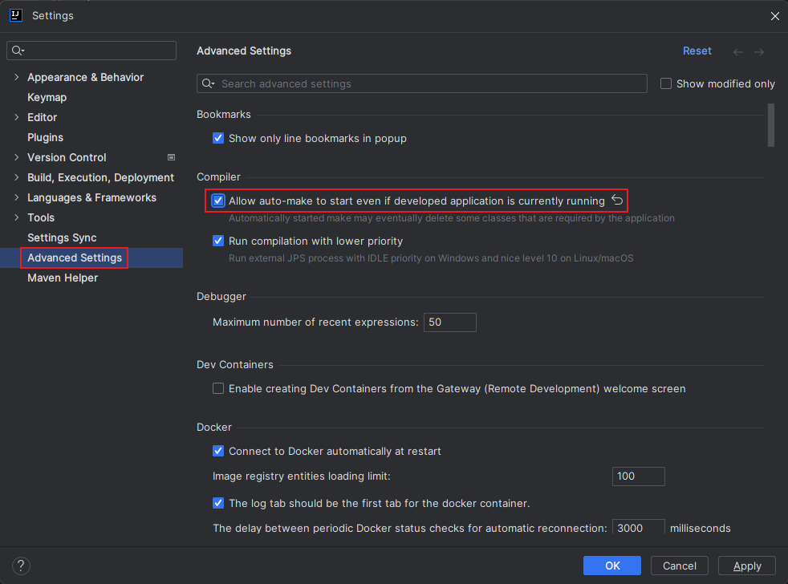
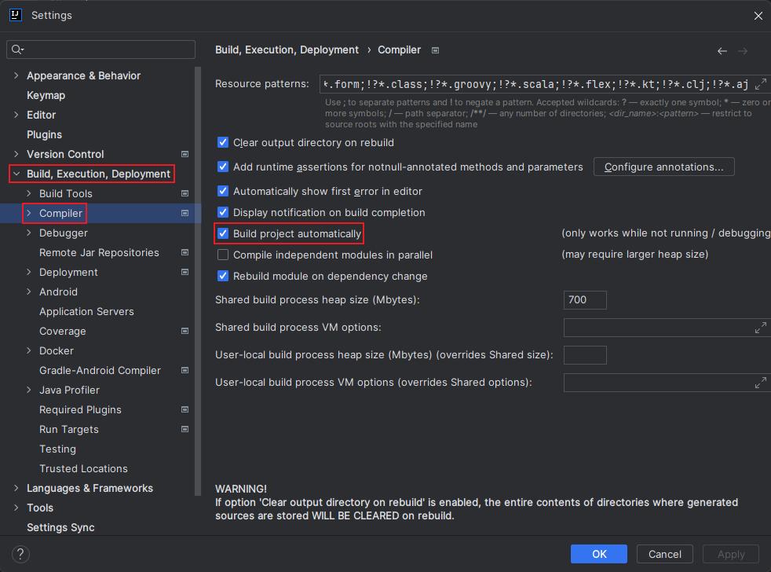

# Spring Boot 热部署实现

1. 引入依赖

   ```xml
   <dependencies>
       <!-- devtools热部署依赖 -->
       <dependency>
           <groupId>org.springframework.boot</groupId>
           <artifactId>spring-boot-devtools</artifactId>
           <!-- 防止将依赖传递到其他模块中 -->
           <optional>true</optional>
           <!-- 只在运行时起作用，打包时不打进去（防止线上执行打包后的程序，启动文件监听线程File Watcher，耗费大量的内存资源） -->
           <scope>runtime</scope>
       </dependency>
   </dependencies>
   ```

2. 添加配置

   ```yaml
   spring:
     devtools:
       restart:
         enabled: true
   ```

3. 更改IDEA设置

   
   
   